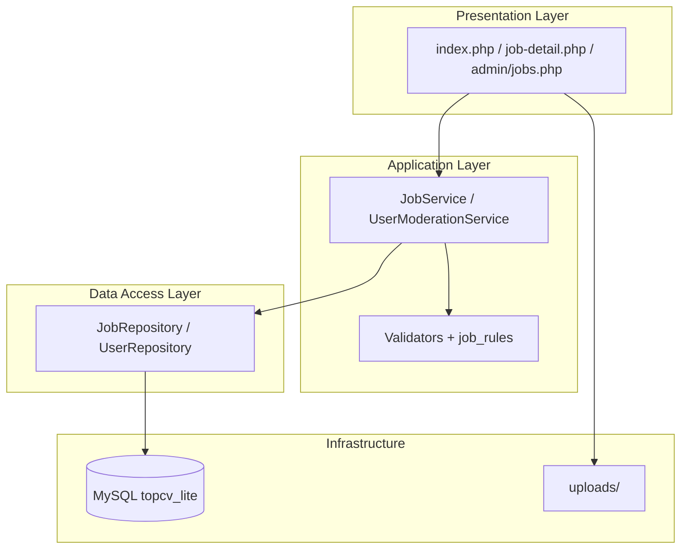

# Architecture Standardization Plan — Mini MVC / Service Layer (PHP thuần)

> **Chỉ kế hoạch — chưa refactor code.**  
> Phù hợp đồ án sinh viên: giữ page-based routing, bổ sung layer mỏng.

---

## 1. Mục tiêu

| Làm | Không làm |
|-----|-----------|
| Tách dần logic lặp sang `includes/services`, `repositories`, `validators` | Rewrite sang Laravel/Symfony |
| Giữ URL và file page hiện tại | Front controller / router tập trung |
| Phase 2 code **mới** viết theo chuẩn mới | Refactor 20 file cùng lúc |
| Giải thích được trong báo cáo đồ án | Over-engineering (DI container, event bus) |

---

## 2. Mô hình đề xuất (Mini MVC trên page PHP)

```text
[Browser] → job-create.php (Page / “Controller mỏng”)
                 │
                 ├─ require guards, csrf, validators
                 ├─ JobService::createFromPost($conn, $userId, $_POST)
                 │       ├─ JobValidator::validateCreate(...)
                 │       └─ JobRepository::insert(...)
                 └─ include view (HTML trong cùng file hoặc partial sau này)
```

| Layer | Thư mục | Trách nhiệm |
|-------|---------|-------------|
| **Page** | `admin/`, `employer/`, `*.php` root | Nhận HTTP, gọi service, redirect, render HTML |
| **Service** | `includes/services/` | Nghiệp vụ: “duyệt job”, “apply”, “soft delete” |
| **Repository** | `includes/repositories/` | SQL thuần: `findById`, `updateStatus`, `listApproved` |
| **Validator** | `includes/validators/` + `*_rules.php` hiện có | Kiểm tra input, deadline, upload |
| **Guard** | `includes/guards/` | `require_role('employer')`, kiểm tra account active |
| **Helper** | `includes/` (csrf, html_content, …) | Tiện ích không phụ thuộc domain |

**View:** vẫn PHP + Bootstrap trong page (MVP). Có thể tách partial `includes/views/partials/job-form.php` khi form quá dài — **tùy chọn Phase 2.2+**.

---

## 3. Cấu trúc thư mục mới (tương thích code cũ)

```text
includes/
├── csrf.php                 # giữ
├── upload_validate.php      # giữ
├── job_rules.php            # giữ — hoặc wrap JobValidator gọi lại
├── html_content.php         # giữ
├── location_picker.php      # giữ
├── guards/
│   ├── require_admin.php
│   ├── require_employer.php
│   └── require_candidate.php
├── validators/
│   ├── JobValidator.php
│   └── UserValidator.php
├── repositories/
│   ├── JobRepository.php
│   ├── UserRepository.php
│   └── ApplicationRepository.php
└── services/
    ├── JobService.php
    ├── UserModerationService.php
    └── ApplicationService.php
```

**Quy tắc tương thích:**

- Page **cũ** không bắt buộc gọi service ngay.  
- Page **đụng Phase 2** — logic mới viết trong service; page chỉ còn ~10–30 dòng orchestration.  
- Repository **không** gọi `header()` / `$_SESSION` — tránh side effect.

---

## 4. Ví dụ luồng (Phase 2 — soft delete job)

**Trước (hiện tại):** `manage-jobs.php` — SQL + redirect trong cùng file.

**Sau (chuẩn mới):**

```php
// employer/manage-jobs.php (rút gọn ý tưởng)
require_once __DIR__ . '/../includes/guards/require_employer.php';
require_once __DIR__ . '/../includes/services/JobService.php';

if ($_SERVER['REQUEST_METHOD'] === 'POST' && ($_POST['action'] ?? '') === 'soft_delete') {
    csrf_validate(...);
    JobService::softDelete($conn, (int)$_POST['job_id'], (int)$_SESSION['user_id']);
    // flash + redirect
}
```

```php
// includes/services/JobService.php
class JobService {
    public static function softDelete(PDO $conn, int $jobId, int $employerUserId): void {
        // kiểm tra ownership
        // JobRepository::markDeleted($conn, $jobId);
    }
}
```

URL vẫn: `employer/manage-jobs.php` — **không đổi**.

---

## 5. Lộ trình refactor dần (không big bang)

| Bước | Khi nào | Việc |
|------|---------|------|
| S0 | Ngay trước Phase 2 | Approve docs: conventions + audit (bước hiện tại) |
| S1 | Phase 2 — Nhóm 2A | Migration status + `UserModerationService` + guard |
| S2 | Phase 2 — Nhóm 2B | `JobService` lifecycle + soft delete; sửa GET delete |
| S3 | Phase 2 — Nhóm 2C | `SavedJobService`, `ModerationLogRepository` |
| S4 | Sau Phase 2 | (Tùy chọn) Rút gọn `apply.php`, `job-create.php` gọi service |

**Nguyên tắc:** mỗi nhóm chỉ refactor **file trong scope nhóm** — regression test giống Phase 1.

---

## 6. Ưu tiên phần Phase 2 sắp đụng

| Ưu tiên | Thành phần | Lý do |
|---------|------------|-------|
| P0 | `JobRepository` + mở rộng `job_rules` / `JobService` | Status, deadline, expiry, soft delete |
| P0 | `UserRepository` + `UserModerationService` | Tách approval vs account |
| P1 | `ModerationLogRepository` | Admin audit trail |
| P1 | `SavedJobRepository` + service | Feature saved jobs |
| P2 | Notification persistence | Có thể để cuối Phase 2 hoặc 2.1 |
| P3 | Refactor `apply.php` sang `ApplicationService` | Đã ổn Phase 1 — không gấp |

---

## 7. Cách trình bày trong báo cáo đồ án

### 7.1 Chương / mục gợi ý

**“3.x Kiến trúc phần mềm”**

1. **Mô hình tổng thể:** Monolith PHP server-rendered (sơ đồ khối: Client → Apache → PHP Pages → PDO → MySQL).  
2. **Lý do chọn PHP thuần:** phạm vi MVP, thời gian, kiểm soát học tập — *không* vì “framework kém”.  
3. **Evolution architecture:**  
   - Giai đoạn 1: Page-based (hình minh họa file tree đơn giản).  
   - Giai đoạn 2: Bổ sung Service/Repository layer (hình sau khi chuẩn hóa).  
4. **So sánh ngắn với MVC đầy đủ:** TopCV Lite = **Partial MVC** / **Page Controller + Service Layer**.

### 7.2 Sơ đồ đề xuất (Word / draw.io)



### 7.3 Câu chữ mẫu (tiếng Việt học thuật)

> “Hệ thống ban đầu triển khai theo mô hình **page-based scripting** phù hợp giai đoạn MVP. Sau Phase 1 (bảo mật và toàn vẹn dữ liệu), nhóm áp dụng **chuẩn hóa kiến trúc lớp mỏng** (Service–Repository) trên nền PHP thuần, **không thay đổi endpoint** và **không migrate framework**, nhằm tách logic nghiệp vụ khỏi tầng trình bày, giảm trùng lặp và chuẩn bị mở rộng Phase 2 (lifecycle, moderation, saved jobs).”

### 7.4 Bảng mapping deliverable ↔ kiến trúc

| Deliverable đồ án | Minh chứng trong repo |
|-------------------|------------------------|
| Sơ đồ use case | `docs/system-overview.md` |
| Sơ đồ luồng duyệt tin | `admin/jobs.php` + Phase 2 moderation log |
| Thiết kế CSDL | `topcv_lite.sql` + `docs/migrations/` |
| Coding standard | `docs/coding-conventions.md` |
| Cải tiến kiến trúc | File này + `pre-phase-2-structure-audit.md` |
| Kiểm thử | Checklist từng `phase-X-plan.md` |

### 7.5 Tránh điểm trừ thường gặp

- **Đừng** gọi là “MVC chuẩn 100%” nếu view và controller vẫn cùng file — hãy dùng **“Page Controller pattern với Service Layer”**.  
- **Nên** nêu rõ trade-off: ít boilerplate hơn Laravel nhưng discipline phải tự quản bằng conventions.  
- **Nên** có 1 bảng “before/after” 1 use case (vd. duyệt job) — 1 cột code cũ (logic trong page), 1 cột code mới (gọi service).

---

## 8. Tiêu chí hoàn thành chuẩn hóa (Definition of Done)

- [ ] `docs/coding-conventions.md` được team/đồ án tuân thủ  
- [ ] Phase 2 nhóm đầu có ít nhất 1 service + 1 repository thật trong code  
- [ ] Không còn thêm GET delete mới  
- [ ] `project-memory` phản ánh layer mới  
- [ ] Báo cáo có sơ đồ + đoạn mô tả evolution architecture  

---

## Tham chiếu

- `docs/coding-conventions.md`  
- `docs/pre-phase-2-structure-audit.md`  
- `docs/phase-2-mini-plan.md`
