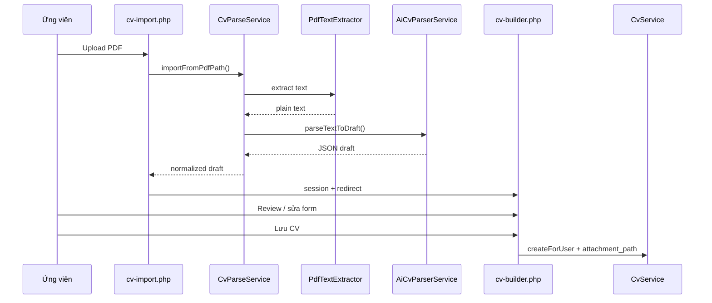

# Phase CV-E — Import PDF → AI trích xuất → điền sẵn form (Mức B)

> **Xác nhận:** User chọn **Mức B** (hybrid: `pdfparser` local + AI API) — 2026-05-29  
> **Phụ thuộc:** CV-D pass + merge `main` (builder đủ section, snapshot, template)  
> **Tham chiếu:** `docs/structured-cv-roadmap.md` (Nhóm CV-E đã chỉnh), `docs/phase-cv-0-ux-spec.md`

---

## 1. Mục tiêu phase

Ứng viên upload **một file PDF CV** → hệ thống **trích xuất text** → gọi **AI** map sang schema structured → mở **cv-builder** với form **điền sẵn** → user **kiểm tra/sửa** → **Lưu** thành `cv_profiles` (+ lưu file gốc vào `attachment_path`).

**Không** làm màn đối chiếu thủ công (file trái / gõ tay phải).  
**Không** auto-lưu DB ngay sau parse — luôn qua bước review trên builder.

---

## 2. Quy trình phase (giống CV-A…D)

| # | Việc | Ai |
|---|------|-----|
| 1 | User đọc plan này | Bạn |
| 2 | User `「xác nhận CV-E」` (đã chọn Mức B) | ✅ |
| 3 | Merge PR projects/fixes (nếu chưa) → `git pull origin main` | Bạn |
| 4 | Tạo nhánh `feature/phase-cv-e-import` từ `main` | Bạn |
| 5 | Cấu hình API key local (`config/ai.local.php`) | Bạn |
| 6 | User `「bắt đầu code CV-E」` | Chờ |
| 7 | Code theo checklist mục 6 (E0→E8) | AI |
| 8 | Test checklist mục 9 | Bạn |
| 9 | User `「CV-E pass」` → commit → PR → merge | Bạn |

**Nhánh bắt buộc:** `feature/phase-cv-e-import` — **không** gộp với nhánh phase khác.

---

## 3. Phạm vi

### 3.1 Làm (MVP CV-E)

| Hạng mục | Chi tiết |
|----------|----------|
| Entry point | `cv-manage.php`: nút **「Tạo CV từ PDF」** → `cv-import.php` |
| Upload | Chỉ **PDF** (MIME `application/pdf`, max 5MB) — kind mới `cv_pdf_import` |
| Trích text | `smalot/pdfparser` (Composer) — không gửi binary PDF lên AI |
| AI parse | **Gemini Flash** (ưu tiên) hoặc OpenAI — text → JSON structured |
| Fallback | Rule-based regex (`cv_parse_fallback.php`) khi API lỗi / timeout |
| Draft | Lưu tạm `$_SESSION['cv_import_draft']` + path file tạm |
| Pre-fill | `cv-builder.php` đọc draft → render form đầy đủ section CV-D |
| Lưu CV | User bấm **Lưu** → `CvService::createForUser()` + `attachment_path` |
| UX | Banner cảnh báo + link **Xem file PDF gốc**; spinner khi đang parse |
| Bảo mật | API key ngoài git; truncate text; không log full CV ra file public |

### 3.2 Không làm (defer CV-F / backlog)

| Hạng mục | Lý do |
|----------|-------|
| PDF scan ảnh (OCR) | Cần Tesseract — phase riêng |
| DOC/DOCX import | Phức tạp; MVP chỉ PDF |
| Parse tại modal apply | Đã chốt CV-C |
| Export PDF từ preview | Phase nhỏ tách riêng nếu cần |
| Queue/async worker | Sync + timeout đủ demo XAMPP |
| Migrate `candidates.cv_path` | Backlog sau import ổn |
| Nhân bản CV | Backlog CV-D |
| Parse 100% chính xác | Không cam kết — UI ghi rõ “gợi ý” |

---

## 4. Luồng nghiệp vụ

```text
cv-manage.php
  [+ Tạo CV mới]          → cv-builder.php (thủ công — giữ nguyên)
  [Tạo CV từ PDF]         → cv-import.php

cv-import.php (GET)
  └── Form upload PDF + [Phân tích và điền form]

cv-import.php (POST)
  1. CSRF + upload_validate('cv_pdf_import')
  2. move_uploaded_file → uploads/cv/import/{userId}_{timestamp}.pdf
  3. CvParseService::importFromPdfPath($path)
       a. PdfTextExtractor → plain text
       b. Nếu len(text) < 80 → lỗi "PDF không có text (có thể là file scan)"
       c. AiCvParserService → JSON draft
       d. (fallback) cv_parse_fallback_from_text() nếu (c) fail
       e. cv_normalize_import_draft() qua cv_rules filters
  4. $_SESSION['cv_import_draft'] = { profile, children, attachment_path, meta }
  5. redirect cv-builder.php?from_import=1

cv-builder.php?from_import=1
  └── Load draft từ session → pre-fill $profile + $children
  └── Banner: "Đã nhập từ PDF — vui lòng kiểm tra trước khi lưu"
  └── Hidden input attachment_path (file đã upload)
  └── User sửa → Lưu → CvService::createForUser (attachment_path kèm theo)
  └── unset session draft sau Lưu thành công
```



---

## 5. Kiến trúc code

### 5.1 File mới

| File | Vai trò |
|------|---------|
| `composer.json` | Dependency `smalot/pdfparser` |
| `vendor/` | Composer install (gitignore `vendor/` — document `composer install`) |
| `config/ai.example.php` | Mẫu cấu hình provider, model, timeout |
| `config/ai.local.php` | **Gitignore** — API key thật |
| `includes/ai_config.php` | Load `ai.local.php` hoặc env; `ai_config_ready()` |
| `includes/services/PdfTextExtractor.php` | PDF → string |
| `includes/services/AiCvParserService.php` | HTTP call Gemini/OpenAI → decode JSON |
| `includes/cv_parse_prompt.php` | System prompt + JSON schema mô tả field |
| `includes/cv_parse_fallback.php` | Regex VN: email, phone, section headers |
| `includes/cv_import_rules.php` | `cv_normalize_import_draft()`, validate draft shape |
| `includes/services/CvParseService.php` | Orchestrator: extract → AI → fallback → normalize |
| `candidate/cv-import.php` | UI upload + POST handler |

### 5.2 File sửa

| File | Thay đổi |
|------|----------|
| `includes/upload_validate.php` | Kind `cv_pdf_import`: chỉ PDF |
| `candidate/cv-manage.php` | Nút「Tạo CV từ PDF」; empty state thêm CTA |
| `candidate/cv-builder.php` | Nhánh `from_import=1`; banner; hidden `attachment_path`; consume session |
| `assets/js/cv-builder.js` | (Nếu cần) trigger render rows khi draft có nhiều dòng child |
| `.gitignore` | `vendor/`, `config/ai.local.php` |
| `docs/structured-cv-roadmap.md` | CV-E = import (đã chỉnh) |
| `docs/dev-learning-log.md` | Sau pass |
| `docs/project-memory/current-task.md` | Sau pass |

### 5.3 Không sửa (regression only)

- `apply.php` / snapshot flow CV-C
- `employer/applicants.php`
- Migration DB mới — **không cần** bảng mới; `attachment_path` đã có từ CV-A

---

## 6. Phase có nặng không? — Có, nên chia E0→E8

| Tiêu chí | Đánh giá |
|----------|----------|
| Độ phức tạp vs CV-D | **Nặng hơn** — thêm Composer, HTTP AI, session draft, 3 lớp service |
| Số file mới | ~10 file PHP + config + 1 trang candidate |
| Rủi ro | API timeout, PDF scan, JSON AI lệch schema, repeater form |
| Thời gian | **~4–6 ngày** nếu làm tuần tự; **~3–4 ngày** nếu test song song từng khối |

**Khuyến nghị:** Không code “một cục” — làm **E0 → E8 tuần tự**, mỗi khối xong thì **test nhỏ** trước khi sang khối sau. Có thể commit mini theo bảng mục 6.1.

### 6.1 Thứ tự & phụ thuộc

```text
E0 (môi trường)
 └── E1 (PDF text) ──┐
                      ├── E3 (orchestrator) ── E4 (upload UI) ── E5 (builder) ── E6 (lưu)
 E2 (AI) ────────────┘                                      └── E7 (security)
                                                              └── E8 (regression)
```

| Khối | Phụ thuộc | Có thể test độc lập? |
|------|-----------|----------------------|
| E0 | — | `composer install`, load `ai_config` |
| E1 | E0 | Script tạm gọi `PdfTextExtractor` + in text |
| E2 | E0 | Script tạm paste text CV → in JSON |
| E3 | E1 + E2 | `CvParseService` với file PDF mẫu |
| E4 | E3 | Upload → redirect (builder có thể chưa pre-fill) |
| E5 | E4 | Form đầy đủ từ session |
| E6 | E5 | Lưu end-to-end |
| E7 | E4 | Rate limit trên import |
| E8 | E6 | Full regression |

### 6.2 Gợi ý commit mini (tuỳ chọn, trong 1 PR)

| Sau khối | Message gợi ý |
|----------|----------------|
| E0 | `chore(cv-e): composer pdfparser và cấu hình AI` |
| E1–E3 | `feat(cv-e): service parse PDF text + AI + fallback` |
| E4–E5 | `feat(cv-e): trang import và pre-fill builder` |
| E6–E7 | `feat(cv-e): lưu attachment và rate limit import` |
| E8 | `docs(cv-e): setup và learning log` |

---

## 6.3 Checklist chi tiết (E0 → E8)

> Mỗi bước: **Làm gì** → **File** → **Cách verify** (tick khi xong).

---

### E0 — Tiền đề & cấu hình (~0.5 ngày)

**Mục tiêu khối:** Máy dev chạy được `pdfparser` và đọc được API key — chưa cần UI.

| # | Làm gì | File / lệnh | Verify |
|---|--------|-------------|--------|
| E0.1 | Pull `main` mới nhất | `git checkout main && git pull` | `git log -1` là merge CV-D/projects |
| E0.2 | Tạo nhánh phase | `git checkout -b feature/phase-cv-e-import` | `git branch --show-current` |
| E0.3 | Khởi tạo Composer | `composer init` (nếu chưa có) | Có `composer.json` ở root |
| E0.4 | Cài pdfparser | `composer require smalot/pdfparser` | Thư mục `vendor/smalot/pdfparser` tồn tại |
| E0.5 | Bootstrap autoload | `includes/composer_bootstrap.php` — `require_once __DIR__.'/../vendor/autoload.php'` nếu file tồn tại | `php -r "require 'includes/composer_bootstrap.php';"` không fatal |
| E0.6 | Gitignore vendor | `.gitignore` thêm `/vendor/` | `git status` không track vendor |
| E0.7 | Mẫu config AI | `config/ai.example.php` (provider, api_key, model, timeout, max_text_chars) | File có đủ key trong mục 8 |
| E0.8 | Loader config | `includes/ai_config.php`: `ai_config()`, `ai_config_ready()` — ưu tiên `config/ai.local.php`, fallback `getenv('GEMINI_API_KEY')` | Gọi `ai_config_ready()` → false khi chưa có key |
| E0.9 | Gitignore key | `.gitignore` thêm `config/ai.local.php` | Key không lên git |
| E0.10 | User tạo key local | Copy example → `config/ai.local.php`, điền Gemini API key | `ai_config_ready()` → true |
| E0.11 | Thư mục upload import | Tạo `uploads/cv/import/` + `.gitkeep` (nếu chưa có pattern) | Ghi file test được |

**✅ Pass E0 khi:** `composer install` OK trên XAMPP; thiếu `ai.local.php` → `ai_config_ready()` false, không crash.

---

### E1 — Trích xuất text PDF (~0.5 ngày)

**Mục tiêu khối:** Đọc được plain text từ PDF text-based — **chưa** gọi AI.

| # | Làm gì | File | Verify |
|---|--------|------|--------|
| E1.1 | Class extractor | `includes/services/PdfTextExtractor.php` | Class load được |
| E1.2 | Method `extract($absPath)` | Trả `['ok'=>bool, 'text'=>string, 'message'=>string]` | |
| E1.3 | Check file tồn tại | `is_file($absPath)` | Path giả → `ok=false` |
| E1.4 | Parse bằng pdfparser | `Parser::parseFile()` trong try/catch | PDF hợp lệ → có text |
| E1.5 | Normalize text | `preg_replace('/\s+/u', ' ', $text)` + trim | Không còn newline thừa liên tiếp |
| E1.6 | Hàm truncate | `includes/cv_import_rules.php` → `cv_import_truncate_text($text, $max)` | Text 20k chars → còn ≤14000 |
| E1.7 | Ngưỡng text quá ngắn | Hằng `CV_IMPORT_MIN_TEXT_LEN = 80` (trong rules hoặc service) | PDF rỗng → message “có thể là file scan” |
| E1.8 | Script test tạm (xóa sau hoặc để docs) | `docs/migrations/_test-pdf-extract.php` — CLI: path PDF → echo len + 200 ký tự đầu | PDF TopCV export → len > 200 |

**✅ Pass E1 khi:** 1 PDF text 1–2 trang → text > 200 ký tự; 1 PDF scan → `ok=false` hoặc len < 80.

---

### E2 — AI parser Gemini (~1–1.5 ngày)

**Mục tiêu khối:** Text thuần → JSON draft — test được bằng script, chưa cần upload.

| # | Làm gì | File | Verify |
|---|--------|------|--------|
| E2.1 | Prompt builder | `includes/cv_parse_prompt.php` → `cv_parse_build_system_prompt()`, `cv_parse_build_user_prompt($text)` | Prompt nhắc schema mục 7, “chỉ JSON” |
| E2.2 | Class AI service | `includes/services/AiCvParserService.php` | |
| E2.3 | Đọc config | Dùng `ai_config()` — model, timeout, api_key | Thiếu key → return `ok=false` sớm |
| E2.4 | HTTP Gemini | POST `https://generativelanguage.googleapis.com/v1beta/models/{model}:generateContent?key=...` | Dùng `curl` hoặc `file_get_contents` stream |
| E2.5 | Body JSON | `contents`, `generationConfig.responseMimeType = application/json` | Response là JSON thuần |
| E2.6 | Timeout | `CURLOPT_TIMEOUT` = config `timeout_seconds` (28) | Không treo vô hạn |
| E2.7 | Retry 1 lần | Nếu HTTP 429/502/503 → sleep 2s → retry | Log ngắn, không log full CV |
| E2.8 | Decode response | Lấy `candidates[0].content.parts[0].text` → `json_decode` | |
| E2.9 | Strip markdown fence | Nếu AI trả ` ```json ` → regex bỏ wrapper | JSON parse được |
| E2.10 | Method public | `parseTextToDraft(string $text): array{ok, draft, message, provider}` | |
| E2.11 | Script test | `docs/migrations/_test-ai-parse.php` — đọc file `.txt` mẫu CV | Có `full_name`, `email`, ≥1 education/experience |

**✅ Pass E2 khi:** Text CV mẫu (copy từ PDF) → JSON hợp lệ, có field cốt lõi.

---

### E3 — Fallback + normalize + orchestrator (~0.5–1 ngày)

**Mục tiêu khối:** Ghép E1+E2 thành một pipeline ổn định; AI lỗi vẫn có draft tối thiểu.

| # | Làm gì | File | Verify |
|---|--------|------|--------|
| E3.1 | Fallback email | `cv_parse_fallback_from_text()` — regex email | |
| E3.2 | Fallback phone VN | Regex `0\d{9}` hoặc dùng `cv_normalize_phone` | |
| E3.3 | Fallback tên | Dòng đầu text (heuristic) hoặc sau “Họ tên:” | |
| E3.4 | Tách section | Split theo header: `HỌC VẤN|KINH NGHIỆM|KỸ NĂNG|...` (VN + EN) | Mỗi block → 0–2 dòng child |
| E3.5 | `cv_normalize_import_draft($raw)` | Map alias key AI (`fullName` → `full_name`) | |
| E3.6 | Default profile fields | `title` rỗng → `"CV import " . date('Y-m-d')` | |
| E3.7 | Chuẩn hóa dates | `cv_normalize_year_month()` cho start/end/issued_at | `2020` → `2020-01` |
| E3.8 | Filter children | Gọi lần lượt `cv_filter_education_rows`, `_experience_`, `_skill_`, `_project_`, `_activity_`, `_certificate_`, `_award_`, `_reference_` | Row rỗng bị loại |
| E3.9 | Giới hạn rows | Max 5 dòng / section sau filter | Tránh form quá dài |
| E3.10 | Class orchestrator | `includes/services/CvParseService.php` | |
| E3.11 | `importFromPdfPath($path, $options)` | Chain: extract → truncate → AI → (fallback nếu fail) → normalize | |
| E3.12 | Meta trong result | `parse_source`: `ai`\|`fallback`\|`ai+fallback`; `warnings[]` | VD: “API timeout, dùng fallback” |
| E3.13 | Return shape | `['ok', 'message', 'profile', 'children', 'meta']` khớp session draft | |
| E3.14 | Test pipeline | `_test-pdf-extract.php` gọi full `CvParseService` | 1 PDF → in profile + count rows |

**✅ Pass E3 khi:** API key sai → vẫn `ok=true` với `parse_source=fallback` và ít nhất email/phone; API đúng → `parse_source=ai` và nhiều field hơn.

---

### E4 — Upload UI `cv-import.php` (~0.5–1 ngày)

**Mục tiêu khối:** User upload PDF → redirect builder (draft trong session).

| # | Làm gì | File | Verify |
|---|--------|------|--------|
| E4.1 | Kind upload PDF only | `includes/upload_validate.php` — `cv_pdf_import`: ext `pdf`, mime `application/pdf`, 5MB | `.docx` → reject |
| E4.2 | Trang import GET | `candidate/cv-import.php` — layout giống candidate pages, require login candidate | Guest → redirect |
| E4.3 | Copy UX | Hướng dẫn: chỉ PDF, kết quả gợi ý, ~30s chờ | |
| E4.4 | Form POST | `enctype multipart`, input `cv_pdf`, nút “Phân tích và điền form” | |
| E4.5 | CSRF | `csrf_field('candidate_cv_import_form')` + validate POST | Token sai → SweetAlert |
| E4.6 | Rate limit (sơ bộ) | Gọi helper E7 hoặc placeholder — có thể hoàn thiện ở E7 | |
| E4.7 | Validate file | `upload_validate($_FILES['cv_pdf'], 'cv_pdf_import')` | |
| E4.8 | Tên file lưu | `uploads/cv/import/{userId}_{YmdHis}_{8hex}.pdf` | Không ghi đè |
| E4.9 | `move_uploaded_file` | Lỗi → SweetAlert, stay on page | |
| E4.10 | Gọi parse | `CvParseService::importFromPdfPath(realpath)` | |
| E4.11 | Lỗi parse | `ok=false` → `$_SESSION['swal_*']`, redirect `cv-import.php` | Không mất file đã upload (hoặc xóa file lỗi — chốt 1) |
| E4.12 | Session draft | `$_SESSION['cv_import_draft'] = ['profile'=>..., 'children'=>..., 'attachment_path'=>'uploads/cv/import/...', 'meta'=>..., 'user_id'=>...]` | |
| E4.13 | Bind user | Lưu `user_id` trong draft; builder sẽ so khớp | |
| E4.14 | Redirect OK | `header('Location: cv-builder.php?from_import=1')` | |
| E4.15 | Loading UX | Nút submit disabled + spinner JS khi POST (form submit 1 lần) | Tránh double submit |
| E4.16 | Link từ manage | `candidate/cv-manage.php` — nút outline “Tạo CV từ PDF” cạnh “Tạo CV mới” | |
| E4.17 | Empty state CTA | Khi chưa có CV — thêm link import | |
| E4.18 | Warning thiếu API key | GET: alert nếu `!ai_config_ready()` — “Chỉ dùng nhận dạng cơ bản” | Vẫn cho upload |

**✅ Pass E4 khi:** Upload PDF text → redirect builder; file invalid → ở lại import + báo lỗi.

---

### E5 — Builder pre-fill (~1 ngày)

**Mục tiêu khối:** `cv-builder.php?from_import=1` hiển thị đủ field + repeater rows từ draft.

| # | Làm gì | File | Verify |
|---|--------|------|--------|
| E5.1 | Chặn import khi edit | Nếu `?id=` > 0 → bỏ qua `from_import`, không đọc session draft | Sửa CV cũ không bị ghi đè |
| E5.2 | Đọc session | `from_import=1` → kiểm tra `cv_import_draft` + `draft['user_id'] === $userId` | Sai user → unset + redirect manage |
| E5.3 | Gán `$profile` | Map từng key: title, full_name, target_position, dob, gender, phone, email, website, address, career_objective, interests, template_key | |
| E5.4 | Gán `$children` | educations, experiences, skills, projects, activities, certificates, awards, references | |
| E5.5 | Phone display | `cv_normalize_phone` trước render | |
| E5.6 | Dates cho repeater | Dùng `cv_split_year_month()` cho từng start/end/issued_at trong PHP loop | Tháng/năm đúng trên input |
| E5.7 | Merge account | Chỉ fill email/phone/full_name từ `users` **nếu** draft field rỗng | Không ghi đè AI |
| E5.8 | Banner alert | Đầu form: info + `meta.parse_source` + `warnings`; link `attachment_path` target `_blank` | |
| E5.9 | Hidden attachment | `<input type="hidden" name="attachment_path" value="...">` | |
| E5.10 | Hidden import flag | (Tuỳ chọn) `from_import=1` hidden để clear session sau save | |
| E5.11 | Repeater PHP | `foreach ($educations as $i => $row)` — **đã có** pattern; đảm bảo ≥1 row mỗi section có data | Nếu AI trả 3 KN → 3 row render server-side |
| E5.12 | Section projects | Chỉ render nếu `$projectsReady` — giống builder hiện tại | |
| E5.13 | JS regression | `cv-builder.js` — add/remove row vẫn hoạt động sau pre-fill | Thêm dòng thủ công OK |
| E5.14 | Session refresh | F5 `?from_import=1` → draft vẫn load (chưa unset) | Hành vi nhất quán |
| E5.15 | Không có draft | `from_import=1` nhưng session trống → redirect `cv-import.php` + thông báo | |

**✅ Pass E5 khi:** Builder mở với ≥5 field profile + ≥1 education hoặc experience; sửa/xóa/thêm row OK.

---

### E6 — Lưu CV + attachment (~0.5 ngày)

**Mục tiêu khối:** Bấm Lưu → DB có structured + `attachment_path`; dọn session.

| # | Làm gì | File | Verify |
|---|--------|------|--------|
| E6.1 | POST nhận attachment | `cv_parse_builder_post()` thêm `'attachment_path' => $post['attachment_path'] ?? ''` | |
| E6.2 | Validate path | Chỉ chấp nhận path bắt đầu `uploads/cv/import/` — chống path traversal | `../../../etc/passwd` → bỏ |
| E6.3 | `normalizeProfileFields` | Đã có `attachment_path` trong `CvService` — đảm bảo flow create nhận từ `$parsed['profile']` | |
| E6.4 | Create flow | POST create (không `cv_id`) + `attachment_path` → `CvService::createForUser` | |
| E6.5 | Clear session | Sau create OK: `unset($_SESSION['cv_import_draft'])` | Lưu xong F5 builder trống |
| E6.6 | Preview | `cv-preview.php?id=` — không cần hiển thị link file (tuỳ chọn) | Structured render OK |
| E6.7 | Manage list (tuỳ chọn) | Icon `fa-paperclip` nếu `attachment_path` not null | |
| E6.8 | Hủy builder | User bấm Hủy → draft vẫn trong session (cho import lại) hoặc unset — **chốt:** giữ session để F5 còn data; Hủy → về manage không xóa draft | Ghi trong learning log |
| E6.9 | File orphan | Không xóa PDF khi Hủy — backlog cleanup | |

**✅ Pass E6 khi:** Lưu → `cv_profiles.attachment_path` đúng; preview + apply snapshot đúng structured.

---

### E7 — Bảo mật & vận hành (~0.5 ngày)

**Mục tiêu khối:** Không lộ key, không spam API, có doc cài đặt.

| # | Làm gì | File | Verify |
|---|--------|------|--------|
| E7.1 | Rate limit helper | `cv_import_rate_limit_check($userId): array{ok, message}` trong `cv_import_rules.php` | |
| E7.2 | Session counter | `$_SESSION['cv_import_hits']` = `[timestamp, ...]` — giữ hit trong 3600s | |
| E7.3 | Max 5/h | Vượt → SweetAlert “Thử lại sau 1 giờ” | |
| E7.4 | Gọi ở E4 POST | Trước parse | |
| E7.5 | Auth | `cv-import.php`, draft load — role `candidate` only | |
| E7.6 | Draft isolation | `draft['user_id']` must match session | User B không thấy draft A |
| E7.7 | Không log PII | `error_log` chỉ message ngắn, không full text CV | |
| E7.8 | Doc setup | `docs/setup-cv-import.md`: Composer, PHP ext (curl, fileinfo), tạo `ai.local.php`, test scripts | |
| E7.9 | Ghi chú XAMPP | `max_execution_time` ≥ 60 cho POST import | Tránh timeout 30s default |

**✅ Pass E7 khi:** Upload 6 lần liên tiếp → lần 6 bị chặn; key không xuất hiện trong HTML/JS.

---

### E8 — Docs & regression (~0.5 ngày)

**Mục tiêu khối:** Đóng phase — không phá CV-C/D.

| # | Làm gì | File | Verify |
|---|--------|------|--------|
| E8.1 | Roadmap | `docs/structured-cv-roadmap.md` — CV-E = import (đã chỉnh) | |
| E8.2 | Learning log | `docs/dev-learning-log.md` — mục CV-E: flow, Gemini, giới hạn | |
| E8.3 | Current task | `docs/project-memory/current-task.md` → CV-E pass | |
| E8.4 | Xóa/ẩn script test | `_test-pdf-extract.php`, `_test-ai-parse.php` — xóa hoặc comment “dev only” | |
| E8.5 | Regression apply | Apply job với CV import → employer modal CV online | Snapshot có section |
| E8.6 | Regression sửa CV sau apply | Employer vẫn thấy bản cũ | |
| E8.7 | Regression builder thủ công | `cv-builder.php` không `from_import` — tạo/sửa bình thường | |
| E8.8 | Regression xóa CV | CV có `attachment_path` — xóa không lỗi (file PDF orphan OK) | |
| E8.9 | Checklist user | Hoàn tất mục 9 bên dưới | |

**✅ Pass E8 / Pass phase:** Toàn bộ mục 9 tick + user `「CV-E pass」`.

---

### 6.4 Bảng tổng hợp effort từng khối

| Khối | Bước con | Ngày ước lượng | Cumulative |
|------|----------|----------------|------------|
| E0 | 11 bước | 0.5 | 0.5 |
| E1 | 8 bước | 0.5 | 1.0 |
| E2 | 11 bước | 1–1.5 | 2.0–2.5 |
| E3 | 14 bước | 0.5–1 | 2.5–3.5 |
| E4 | 18 bước | 0.5–1 | 3.0–4.5 |
| E5 | 15 bước | 1 | 4.0–5.5 |
| E6 | 9 bước | 0.5 | 4.5–6.0 |
| E7 | 9 bước | 0.5 | 5.0–6.5 |
| E8 | 9 bước | 0.5 | 5.5–7.0 |

*Thực tế thường **4–6 ngày** nếu làm tập trung; **7 ngày** nếu kẹt prompt AI hoặc PDF test.*

---

## 7. JSON schema (AI output)

AI **phải** trả về object (không array root). Key snake_case, string rỗng nếu không tìm thấy.

```json
{
  "title": "CV IT Fresher 2026",
  "full_name": "",
  "target_position": "",
  "date_of_birth": "YYYY-MM-DD hoặc rỗng",
  "gender": "Nam|Nữ|Khác|rỗng",
  "phone": "",
  "email": "",
  "website": "",
  "address": "",
  "career_objective": "",
  "interests": "",
  "educations": [
    {
      "start_date": "YYYY-MM",
      "end_date": "YYYY-MM",
      "school_name": "",
      "major": "",
      "description": ""
    }
  ],
  "experiences": [
    {
      "start_date": "YYYY-MM",
      "end_date": "YYYY-MM",
      "company_name": "",
      "position": "",
      "description": ""
    }
  ],
  "skills": [{ "skill_name": "", "description": "" }],
  "projects": [{ "start_date": "", "end_date": "", "project_name": "", "position": "", "description": "" }],
  "activities": [{ "start_date": "", "end_date": "", "organization": "", "role": "", "description": "" }],
  "certificates": [{ "issued_at": "YYYY-MM", "certificate_name": "" }],
  "awards": [{ "awarded_at": "YYYY-MM", "title": "", "description": "" }],
  "references": [{ "full_name": "", "position": "", "contact_info": "" }]
}
```

**Quy tắc prompt:**

- Ngôn ngữ CV: Việt hoặc Anh — giữ nguyên nội dung tiếng gốc
- Không bịa field không có trong text
- `end_date` = `null` trong JSON → map thành rỗng; “hiện tại/nay” → tháng hiện tại
- Tối đa 5 dòng mỗi section child (tránh JSON khổng lồ)

---

## 8. Cấu hình AI (mẫu)

`config/ai.example.php`:

```php
<?php
return [
    'provider' => 'gemini', // gemini | openai
    'api_key' => 'YOUR_KEY_HERE',
    'model' => 'gemini-2.0-flash',
    'timeout_seconds' => 28,
    'max_text_chars' => 14000,
];
```

Copy → `config/ai.local.php` (gitignore). Production: có thể đọc `getenv('GEMINI_API_KEY')`.

**Chi phí ước tính demo:** Gemini Flash free tier — vài chục lần test/ngày thường đủ đồ án.

---

## 9. Test checklist (user)

### Chuẩn bị

- [ ] `main` đã merge CV-D (+ projects nếu có)
- [ ] Nhánh `feature/phase-cv-e-import`
- [ ] `composer install` OK
- [ ] `config/ai.local.php` có API key hợp lệ
- [ ] Chuẩn bị 2 PDF: (1) CV text TopCV export, (2) CV layout 2 cột

### Import happy path

- [ ] `cv-manage` → **Tạo CV từ PDF** → upload PDF text → spinner → builder mở
- [ ] Form có: họ tên, email hoặc SĐT, ≥1 học vấn hoặc kinh nghiệm, vài skills
- [ ] Banner cảnh báo hiển thị; link xem PDF gốc mở được
- [ ] Sửa 1 field → Lưu → `cv-manage` thấy CV mới; preview đúng
- [ ] Apply job → employer **CV online** snapshot đúng (regression CV-C)

### Lỗi & edge

- [ ] File > 5MB → từ chối
- [ ] File .docx đổi tên .pdf → từ chối MIME
- [ ] PDF scan ảnh (không text) → thông báo rõ, gợi ý tạo thủ công
- [ ] API key sai → fallback hoặc lỗi có hướng dẫn (không white screen)
- [ ] Refresh `cv-builder?from_import=1` → draft vẫn còn (session) hoặc hướng import lại (chốt 1 hành vi)
- [ ] User B không truy cập draft user A

### Regression

- [ ] **Tạo CV mới** thủ công (không import) vẫn OK
- [ ] Sửa CV cũ `?id=` không bị lẫn import
- [ ] Xóa CV không crash khi có `attachment_path`

---

## 10. Ước lượng effort

| Khối | Ước lượng |
|------|-----------|
| E0 + E1 (Composer + PDF text) | 0.5–1 ngày |
| E2 (AI service + prompt) | 1–1.5 ngày |
| E3 (fallback + normalize) | 0.5–1 ngày |
| E4 + E5 (UI import + builder) | 1–1.5 ngày |
| E6 + E7 + E8 (lưu, security, test) | 0.5–1 ngày |
| **Tổng** | **~4–6 ngày** (1 dev, kèm test PDF thật) |

---

## 11. Git

```
phase CV: import PDF và AI điền sẵn form CV (nhóm CV-E, Mức B)
```

PR: `feature/phase-cv-e-import` → `main`

---

## 12. Sau CV-E (CV-F — tùy chọn)

| Hạng mục | Mô tả |
|----------|--------|
| OCR | Tesseract cho PDF scan |
| DOCX | PhpWord / convert → text |
| Queue | `cv_import_jobs` + status UI |
| Chất lượng | Fine-tune prompt, scoring confidence từng field |
| Export PDF | Dompdf từ `cv-preview` |

---

## 13. Bước tiếp theo

1. Bạn: merge `main` mới nhất, tạo nhánh, cấu hình `ai.local.php`
2. Gửi **`「bắt đầu code CV-E」`** khi sẵn sàng
3. AI implement theo E0→E8, báo cáo từng khối khi xong
