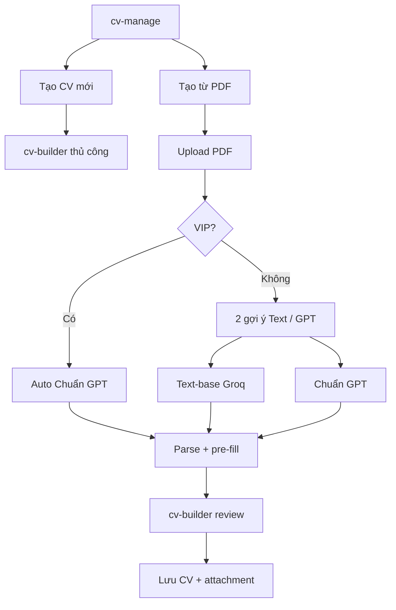

# Phase CV-F — GPT Vision scan PDF + import nâng cao (Mức C)

> **Xác nhận:** User **`「xác nhận CV-F」`** — 2026-06-05  
> **Phụ thuộc:** CV-E pass + merge `main`  
> **Provider chính:** OpenAI GPT (vision + PDF input) — user đã chốt dùng GPT để scan PDF  
> **Tham chiếu:** `docs/phase-cv-e-plan.md`, `docs/setup-cv-import.md`, `docs/structured-cv-roadmap.md`

---

## 0. Trả lời câu hỏi: có tìm được tài liệu trên mạng không?

**Có.** Đã tra cứu và đối chiếu với codebase CV-E hiện tại. Tóm tắt nguồn học hỏi:

| Nguồn | Bài học áp dụng cho TopCV Lite |
|-------|--------------------------------|
| [OpenAI — File inputs / PDF](https://developers.openai.com/api/docs/guides/pdf-files/) | GPT-4o+ nhận **PDF trực tiếp** (`input_file`): API tự gửi **text layer + ảnh từng trang** → phù hợp PDF scan & layout 2 cột Canva |
| [OpenAI Cookbook — Data extraction ELT](https://developers.openai.com/cookbook/examples/data_extraction_transformation) | Pipeline 2 bước (extract → transform schema) hữu ích khi PDF rất dài; CV 1–3 trang thường **1 bước** đủ |
| [OpenAI — Structured Outputs](https://developers.openai.com/api/docs/guides/structured-outputs) | Dùng `json_schema` + `strict: true` thay vì chỉ `response_format: json` — giảm lệch schema so với CV-E (Groq text) |
| [resume-intel](https://github.com/Edwinfom00/resume-intel) | **Task decomposition** theo section + retry khi JSON fail; **spatial vs linear** extraction |
| [Alibaba SmartResume](https://github.com/alibaba/SmartResume) | Layout-aware: OCR vùng ảnh + metadata PDF → LLM; mAP layout ~92% |
| [arxiv — Layout-Aware Resume IE](https://arxiv.org/pdf/2510.09722) | **Parallel prompts** (basic / work / education) chính xác hơn 1 prompt khổng lồ — đề xuất **F2-lite** |
| [Pondhouse — GPT-4o document extraction](https://www.pondhouse-data.com/blog/document-extraction-with-gpt4o) | Với document text-heavy: `detail: low` đủ; CV scan cần layout → dùng PDF native input của OpenAI |
| Thực tế CV-E (Groq + pdfparser) | Text path nhanh/rẻ; fail khi **PDF scan** (len < 80) hoặc **Canva 2 cột** (noise cao, mô tả lẫn mục) |

**Kết luận thiết kế:** CV-F **không thay** CV-E — bổ sung **đường Vision GPT** khi text path không đủ tin cậy, tái sử dụng toàn bộ normalize → builder → lưu `attachment_path`.

---

## 1. Mục tiêu phase

| Mục tiêu | Mô tả |
|----------|--------|
| **Scan chuẩn** | PDF ảnh (scan/photo export), PDF thiết kế 2 cột, watermark — đọc được qua **GPT vision** |
| **Kết quả khớp form** | JSON map đúng schema CV-D → pre-fill builder; giảm mục “chỉ có ngày không có công ty” |
| **Prompt chuẩn** | System prompt layout-aware + Structured Outputs; rule ghép thời gian ↔ entity (kế thừa CV-E) |
| **Thực tế vận hành** | Smart router: text tốt → CV-E (rẻ); text kém/scan → CV-F (GPT); user có thể **ép GPT** |
| **Không phá CV-E** | Groq/Gemini text path giữ nguyên làm default nhanh |

**Không cam kết:** parse 100% — luôn qua builder review (giống CV-E).

---

## 2. So sánh CV-E vs CV-F

```text
                    ┌─────────────────────────────────────┐
                    │         cv-import.php (upload)         │
                    └─────────────────┬───────────────────┘
                                      │
                    ┌─────────────────▼───────────────────┐
                    │     CvParseService (orchestrator)    │
                    │  1. PdfTextExtractor (local)         │
                    │  2. cv_import_analyze_pdf_quality()  │
                    │  3. Route parse mode                 │
                    └─────────┬───────────────┬───────────┘
                              │               │
               text OK        │               │  scan / noisy / user chọn GPT
                              ▼               ▼
                    ┌──────────────┐  ┌──────────────────────┐
                    │ CV-E path    │  │ CV-F path (Mức C)    │
                    │ Groq/Gemini  │  │ OpenAI GPT-4o        │
                    │ text → JSON  │  │ PDF file → JSON      │
                    └──────┬───────┘  └──────────┬───────────┘
                           │                     │
                           └──────────┬──────────┘
                                      ▼
                    ┌─────────────────────────────────────┐
                    │ cv_normalize_import_draft()          │
                    │ cv_import_prune_incomplete_children()│
                    │ merge fallback regex (email/phone)   │
                    └─────────────────┬───────────────────┘
                                      ▼
                         session draft → cv-builder
```

| Tiêu chí | CV-E (Mức B) | CV-F (Mức C) |
|----------|---------------|--------------|
| Input AI | Plain text (pdfparser) | **PDF file** (base64 hoặc Files API) |
| Model | Groq / Gemini / OpenRouter | **OpenAI gpt-4o** (vision) |
| PDF scan | ❌ Fail | ✅ |
| Layout 2 cột Canva | ⚠️ Text noise | ✅ Tốt hơn |
| Chi phí / lần | ~$0 (Groq free) | ~$0.02–0.08 / CV (ước lượng) |
| Latency | ~5–15s | ~15–45s |
| Structured output | JSON mode (prompt) | **json_schema strict** |

---

## 3. Chiến lược parse (học từ dự án production)

### 3.1 Smart Router (bắt buộc F1)

Sau `PdfTextExtractor::extract()`, tính **quality score** (mở rộng `noise_score` CV-E):

| Tín hiệu | Ý nghĩa |
|----------|---------|
| `text_len < 80` | Khả năng cao **PDF scan** → auto GPT |
| `noise_score >= 0.35` | Canva / text dính / lặp → GPT |
| `ratio_alnum < 0.5` | Nhiễu glyph | 
| User chọn **「Phân tích chuẩn (GPT)」** | Force GPT |
| Text len > 500 && noise < 0.15 | **Fast path** CV-E (Groq) |

`meta.parse_mode`: `text_fast` | `vision_gpt` | `vision_gpt_forced` | `fallback_only`

### 3.2 Một lần gọi vs decomposition (F2 vs F2+)

**MVP CV-F (F2):** 1 request GPT + PDF + schema đầy đủ  
- Đủ cho CV 1–3 trang demo đồ án  
- Prompt chặt (mục 7) + `cv_import_prune_incomplete_children()`  

**Nâng cao (F2+ — tùy chọn sau pass):** 3 parallel call như paper arxiv:
1. `basics` — profile fields  
2. `experiences` + `projects` + `activities`  
3. `educations` + `skills` + certificates/awards/references  

→ Ghép JSON → normalize. Chính xác hơn ~10–15% trên PDF phức tạp, tốn 3× token.

**Khuyến nghị:** Code F2 trước; F2+ chỉ bật nếu test PDF Canva vẫn lệch.

### 3.3 Structured Outputs (OpenAI)

PHP gọi **Responses API** hoặc **Chat Completions** với:

```json
{
  "type": "json_schema",
  "json_schema": {
    "name": "cv_import_draft",
    "strict": true,
    "schema": { "...": "xem includes/cv_parse_schema.json" }
  }
}
```

Schema mirror `cv_parse_prompt.php` — snake_case, arrays capped (max 5 items/section ở normalize layer).

### 3.4 Fallback & retry

| Bước | Hành vi |
|------|---------|
| GPT HTTP 429/5xx | Retry 1 lần, sleep 2s |
| JSON invalid / refusal | Retry 1 lần kèm lỗi parse ngắn |
| GPT fail hoàn toàn | Fallback CV-E text (nếu có text) hoặc regex-only |
| Email/phone trống | Merge từ `cv_parse_fallback_from_text()` |

---

## 4. Luồng nghiệp vụ (UX) — đã chốt với user (2026-06)

### 4.1 Quản lý CV — 2 cách tạo

| Cách | Trang | Ghi chú |
|------|-------|---------|
| **Tự nhập** | `cv-builder.php` | Form thủ công, không đổi |
| **Tạo từ PDF** | `cv-import.php` → (bước 2 chọn engine) | Upload trước, chọn cách phân tích sau |

**Không** bắt user chọn loại file (text vs scan). User chỉ upload **một PDF**; router phân tích chất lượng rồi **gợi ý 2 lựa chọn**.

### 4.2 Luồng 2 bước (thường + VIP)

```text
cv-manage
  [Tạo CV mới]        → cv-builder (thủ công)
  [Tạo CV từ PDF]     → cv-import.php

Bước 1 — Upload (POST cv-import.php)
  - Chọn file PDF (max 5MB)
  - Lưu file tạm uploads/cv/import/{user}_{ts}.pdf
  - PdfTextExtractor + cv_import_analyze_pdf_quality() — CHƯA gọi AI parse
  - Session: cv_import_pending = { path, quality, uploaded_at, user_id }

Bước 2 — Chọn cách phân tích (GET cv-import-choose.php)  ← F4 mới
  Router đã có quality → hiển thị 2 card:

  ┌─────────────────────────────────────────────────────────────┐
  │ Card A: Text-base (Groq)     │ Card B: Chuẩn GPT (vision)   │
  │ • Khuyến nghị PDF text sạch  │ • Canva / scan / layout phức tạp│
  │ • Thường: KHÔNG giới hạn*    │ • Thường: tối đa 5 lần**      │
  │ • Nhanh ~10–20s              │ • Chậm hơn ~30–45s            │
  └─────────────────────────────────────────────────────────────┘

  * Giữ rate limit chống spam (VD 20 lần/giờ) — không phải quota VIP.
  ** Quota GPT Chuẩn — user thường; VIP: không giới hạn (xem 4.3).

  Nếu quality = noisy / likely_scan:
  - Banner vàng: "PDF text nhiễu hoặc scan — Text-base có thể thiếu field.
    Nên dùng Chuẩn GPT (VIP không giới hạn)."
  - Card Text-base: disabled hoặc [Dùng thử] + cảnh báo mạnh
  - Card GPT: highlighted "Khuyến nghị"

  User bấm [Phân tích với Text-base] hoặc [Phân tích Chuẩn GPT]
    → POST parse_mode=text | vision
    → CvParseService::importFromPdfPath($path, ['parse_mode' => ...])
    → session cv_import_draft → redirect cv-builder?from_import=1

Bước 3 — Builder review → Lưu (giữ CV-E)
```



### 4.3 VIP (defer implementation, thiết kế sẵn hook)

| Vai trò | Text-base | Chuẩn GPT |
|---------|-----------|-----------|
| **Thường** | Không giới hạn quota* | **Tối đa 5 lần / tổng đời tài khoản** |
| **VIP** | Không giới hạn | **Không giới hạn** + **bỏ qua màn chọn** → auto GPT sau upload |

Hook code (F4/F5):
- `cv_user_import_is_vip(int $userId): bool` — MVP return `false`; sau gắn bảng/plan VIP
- `cv_import_gpt_quota_check($userId): array{ok, remaining, message}` — thường ≤5 **tổng đời**
- `cv_import_gpt_quota_record($userId)` — sau parse vision thành công
- Rate limit import chung (5/giờ CV-E) → tách: text nhẹ hơn, GPT quota riêng

**Copy UI gợi ý VIP (PDF nhiễu):**
> "File PDF thiết kế hoặc scan — bản text có thể lộn xộn. **Chuẩn GPT** đọc layout chính xác hơn.  
> Bạn còn **X/5** lần Chuẩn GPT (còn lại trên tài khoản). **Nâng cấp VIP** để không giới hạn.

### 4.4 Thay đổi so với plan cũ (radio trước upload)

| Cũ (plan draft) | Mới (user chốt) |
|-----------------|-----------------|
| 3 radio trước upload: auto / text / vision | Upload trước → **màn chọn 2 card** sau router |
| Auto router quyết luôn | Router **chỉ gợi ý**; user (hoặc VIP) quyết |
| Rate limit GPT 3/h | GPT quota **5/tổng đời** thường; VIP unlimited |

F1 router (`cv_import_analyze_pdf_quality`, `parse_mode`) **giữ nguyên** — dùng cho gợi ý UI + khi user/VIP chọn engine.

### 4.5 Builder banner (giữ)

- "Phân tích Text-base (Groq)" / "Phân tích Chuẩn GPT"
- Link PDF gốc; warnings từ meta
- VIP: badge nhỏ (tuỳ chọn sau)

**DOCX (F7 — defer)** | **Queue async — defer**

---

## 5. Kiến trúc code

### 5.1 File mới

| File | Vai trò |
|------|---------|
| `includes/cv_parse_schema.json` | JSON Schema strict cho OpenAI Structured Outputs |
| `includes/cv_import_pdf_quality.php` | `cv_import_analyze_pdf_quality($text, $extractMeta): array` |
| `includes/cv_parse_vision_prompt.php` | System/user prompt **layout-aware** (PDF vision) |
| `includes/services/OpenAiCvVisionParserService.php` | Upload/base64 PDF → OpenAI → decode JSON |
| `docs/setup-cv-import.md` | Bổ sung mục OpenAI key, model, chi phí |

### 5.2 File sửa

| File | Thay đổi |
|------|----------|
| `config/ai.example.php` | Thêm block `openai`: api_key, model (`gpt-4o`), vision_enabled, max_pdf_pages |
| `includes/ai_config.php` | `ai_openai_ready()`, load vision config |
| `includes/services/CvParseService.php` | Router + `importFromPdfPath($path, $options)` |
| `includes/services/AiCvParserService.php` | (Tuỳ chọn) tách provider text vs vision |
| `candidate/cv-import.php` | Toggle parse mode; copy UX |
| `candidate/cv-builder.php` | Banner hiển thị `meta.parse_mode` |
| `includes/cv_import_rules.php` | Rate limit riêng GPT (VD max 3 GPT/h/user) |

### 5.3 Không sửa

- DB schema (dùng `attachment_path` CV-E)
- Apply / snapshot / employer
- `cv_parse_fallback.php` logic cốt lõi

---

## 6. OpenAI API — implementation notes (PHP/XAMPP)

### 6.1 Endpoint khuyến nghị

**Responses API** (2025+):

```http
POST https://api.openai.com/v1/responses
Authorization: Bearer {OPENAI_API_KEY}
```

Body (rút gọn):

```json
{
  "model": "gpt-4o",
  "input": [{
    "role": "user",
    "content": [
      { "type": "input_file", "filename": "cv.pdf", "file_data": "data:application/pdf;base64,..." },
      { "type": "input_text", "text": "<user prompt + schema rules>" }
    ]
  }],
  "text": {
    "format": {
      "type": "json_schema",
      "name": "cv_import_draft",
      "strict": true,
      "schema": { }
    }
  }
}
```

**Alternative:** Files API upload `purpose=user_data` → `file_id` trong request (tránh base64 lớn trên RAM).

### 6.2 Giới hạn vận hành

| Giới hạn | Xử lý |
|----------|--------|
| PDF ≤ 50 MB (OpenAI) | Upload validate 5 MB (giữ CV-E) — an toàn |
| Token cao (text + ảnh trang) | Max **5 trang** CV; từ chối PDF > 5 trang + hướng dẫn rút gọn |
| `max_execution_time` | 60s trên import POST |
| Không log PII | Log: mode, page count, token usage ước lượng — không full JSON CV |

### 6.3 Config mẫu (`config/ai.local.php`)

```php
return [
    // CV-E (text — giữ nguyên)
    'provider' => 'groq',
    'api_key' => 'gsk_...',
    'model' => 'llama-3.3-70b-versatile',

    // CV-F (vision)
    'openai' => [
        'api_key' => 'sk-...',
        'model' => 'gpt-4o',
        'timeout_seconds' => 55,
        'max_pdf_pages' => 5,
        'enabled' => true,
    ],
    'parse_default_mode' => 'auto', // auto | text | vision
];
```

---

## 7. Prompt chuẩn (Vision)

### 7.1 System prompt (tóm tắt)

```
Bạn là chuyên gia trích xuất CV tiếng Việt/Anh từ PDF (cả scan và digital).
Bạn nhìn được layout: cột trái/phải, header, icon, bảng.
Nhiệm vụ: đọc đúng thứ tự đọc của con người (thường cột trái trước hoặc top→bottom),
ghép mỗi khoảng thời gian với đúng trường học / công ty / dự án gần nhất về mặt thị giác.
KHÔNG bịa. Field không thấy → "".
KHÔNG tạo mục chỉ có ngày mà thiếu tên trường/công ty/dự án/tổ chức.
Chỉ trả JSON theo schema (Structured Output).
```

### 7.2 User prompt — rule bổ sung so với CV-E text

| Rule | Lý do |
|------|-------|
| Đọc **sidebar** (avatar, contact) tách khỏi body | Canva/TopCV template |
| Bullet / gạch đầu dòng → gộp vào `description` đúng mục | Tránh lẫn KN vs KN |
| “Hiện tại”, “nay”, “present” → `end_date` = `""` | Chuẩn hóa |
| Năm đơn → `YYYY-01` | Khớp builder |
| Skills: tách từng skill; không gộp cả đoạn paragraph | |
| certificates/awards: chỉ khi có tên rõ | |
| Tối đa 5 mục / section trong output | Giảm hallucination |

### 7.3 Ví dụ few-shot (optional, ngắn)

Nhúng 1 ví dụ **mini** trong system prompt (không full CV thật — tránh token):

```json
// Một experience hợp lệ:
{"start_date":"2021-03","end_date":"2023-08","company_name":"ABC Corp","position":"Developer","description":"..."}
// KHÔNG xuất:
{"start_date":"2021-03","end_date":"2023-08","company_name":"","position":"","description":""}
```

---

## 8. Chia khối F0 → F8

```text
F0 (config OpenAI)
 └── F1 (quality router)
       └── F2 (OpenAiCvVisionParserService)
             └── F3 (integrate CvParseService)
                   └── F4 (UI import toggle + banner)
                         └── F5 (rate limit GPT)
                               └── F6 (test PDF bộ mẫu)
                                     └── F7 (DOCX — optional)
                                           └── F8 (docs + regression)
```

| Khối | Nội dung | Ngày ước lượng |
|------|----------|----------------|
| **F0** | `ai.example.php`, `ai_config.php`, OpenAI key, test curl/script | 0.5 |
| **F1** | `cv_import_pdf_quality.php`, route logic trong `CvParseService` | 0.5 |
| **F2** | Vision service + `cv_parse_schema.json` + vision prompt | 1–1.5 |
| **F3** | Ghép pipeline, meta, fallback chain | 0.5 |
| **F4** | `cv-import.php` toggle; builder banner | 0.5 |
| **F5** | Rate limit GPT riêng (3/h); không log PII | 0.25 |
| **F6** | Test 4 PDF: text OK, Canva 2 cột, scan, mixed EN/VN | 0.5–1 |
| **F7** | DOCX qua OpenAI text (optional) | 0.5–1 |
| **F8** | Learning log, roadmap, regression CV-E | 0.5 |
| **Tổng** | | **~4–6 ngày** |

---

## 9. Bộ test PDF bắt buộc (F6)

Chuẩn bị **4 file** trước khi code F2:

| # | Loại PDF | Kỳ vọng |
|---|----------|---------|
| T1 | TopCV export text 1 trang | Auto → **text_fast**; kết quả ≈ CV-E |
| T2 | Canva 2 cột + icon | Auto hoặc force GPT → ≥1 KN + ≥1 HV/KN đúng tên |
| T3 | Scan ảnh (photo PDF) | Auto → **vision_gpt**; có họ tên + ≥1 section |
| T4 | EN resume 2 trang | GPT; dates YYYY-MM |

**Tiêu chí pass field (không cần 100%):**

- [ ] `full_name` hoặc `email` hoặc `phone` đúng ≥1  
- [ ] Không có experience chỉ có date không có `company_name` (sau prune)  
- [ ] Builder mở được; Lưu → preview OK  
- [ ] `meta.parse_mode` hiển thị đúng  

---

## 10. Phạm vi & defer

### Làm (MVP CV-F)

- GPT-4o PDF vision + Structured Outputs  
- Smart router auto / text / vision  
- Tái sử dụng normalize + builder + attachment  
- Rate limit GPT  
- Doc setup OpenAI  

### Không làm (backlog)

| Hạng mục | Lý do |
|----------|-------|
| Tesseract OCR local | User chọn GPT scan; tránh cài thêm binary XAMPP |
| F2+ decomposition 3 call | Chỉ nếu F2 chưa đủ sau test |
| Queue `cv_import_jobs` | Phase sau — VPS/worker |
| Confidence score từng field | UI phức tạp; defer |
| Export PDF preview | Phase riêng |
| Parse tại apply | Đã chốt CV-C |

---

## 11. Rủi ro & giảm thiểu

| Rủi ro | Giảm thiểu |
|--------|------------|
| Chi phí GPT | Default **auto**; text path khi đủ tốt; rate limit 3 GPT/h |
| Timeout 30s XAMPP | `max_execution_time=60`; timeout API 55s |
| PDF dài bị cắt context | Giới hạn 5 trang; báo user |
| Hallucination công ty | Prompt chặt + prune incomplete + user review |
| Lộ OpenAI key | `ai.local.php` gitignore; không echo key |
| Regression CV-E | Test T1 + builder thủ công sau mỗi khối |

---

## 12. Quy trình phase (giống CV-E)

| # | Việc | Ai |
|---|------|-----|
| 1 | User đọc plan này | Bạn |
| 2 | User `「xác nhận CV-F」` | Bạn |
| 3 | Merge CV-E → `main`; `git pull`; nhánh `feature/phase-cv-f-vision` | Bạn |
| 4 | Cấu hình `openai.api_key` trong `ai.local.php` | Bạn |
| 5 | Chuẩn bị 4 PDF test (mục 9) | Bạn |
| 6 | User `「bắt đầu code CV-F」` | Chờ |
| 7 | Code F0→F8; test từng khối | AI |
| 8 | User test → `「CV-F pass」` → commit → PR | Bạn |

**Nhánh:** `feature/phase-cv-f-vision` — tách khỏi CV-E.

**Commit gợi ý:** `phase CV: GPT vision scan PDF import (nhóm CV-F, Mức C)`

---

## 13. Tham chiếu kỹ thuật

- OpenAI PDF inputs: https://developers.openai.com/api/docs/guides/pdf-files/
- OpenAI Structured Outputs: https://developers.openai.com/api/docs/guides/structured-outputs
- OpenAI Cookbook ELT: https://developers.openai.com/cookbook/examples/data_extraction_transformation
- resume-intel pipeline: https://github.com/Edwinfom00/resume-intel
- SmartResume: https://github.com/alibaba/SmartResume
- Layout-aware paper: https://arxiv.org/pdf/2510.09722

---

## 14. Bước tiếp theo

1. Bạn đọc plan — góp ý scope (có cần F7 DOCX ngay không?)  
2. Gửi **`「xác nhận CV-F」`**  
3. Merge CV-E vào `main` (nếu chưa)  
4. Tạo OpenAI key + chuẩn bị PDF test  
5. Gửi **`「bắt đầu code CV-F」`** khi sẵn sàng
