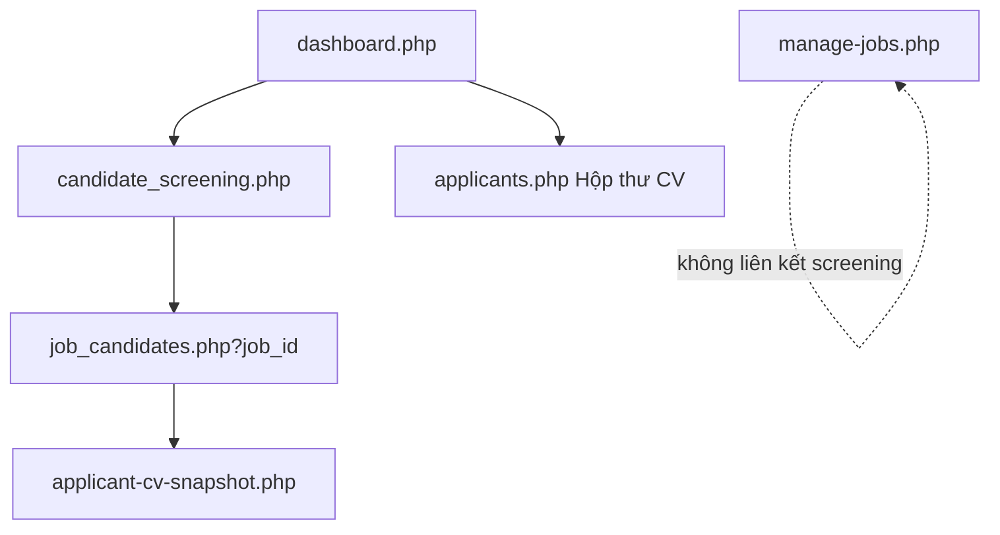

# Phase EMP-A — Sàng lọc ứng viên (Employer screening foundation)

> **Xác nhận:** User **`「xác nhận EMP-A」`** — 2026-06-06  
> **Phụ thuộc:** CV-C pass (apply + snapshot), Phase 2B job soft delete, employer panel  
> **Nhánh:** `feature/phase-emp-a-screening`  
> **Tham chiếu:** `docs/master-refactor-roadmap.md` (Phase 4 AI — foundation), `includes/job_rules.php`, `employer/applicants.php`

---

## 1. Mục tiêu phase

Tách **quản lý vòng đời tin** khỏi **xử lý ứng viên theo tin**:

| Trang | Vai trò | Không làm |
|-------|---------|-----------|
| `manage-jobs.php` | Sửa, xóa mềm, restore, trạng thái admin, admin note | Flow screening / AI |
| **`candidate_screening.php`** | Hub: tin đang tuyển + tin hết hạn còn CV | CRUD tin |
| **`job_candidates.php`** | Danh sách UV của **một tin** | AI ranking (defer EMP-B) |

**Nguyên tắc nghiệp vụ đã chốt:**

> **Hết hạn = ngừng nhận hồ sơ mới.** NTD **vẫn** xem và cập nhật trạng thái CV đã nộp.

---

## 2. Quy trình phase

| # | Việc | Ai |
|---|------|-----|
| 1 | User đọc plan + checklist | Bạn |
| 2 | User **`「xác nhận EMP-A」`** | ✅ 2026-06-06 |
| 3 | Nhánh `feature/phase-emp-a-screening` từ `main` | ✅ |
| 4 | User **`「bắt đầu EMP-A」`** / **`「bắt đầu A1」`** | Chờ |
| 5 | Code A1 → A3 theo checklist | AI |
| 6 | User test → **`「Ax pass」`** → commit (khi yêu cầu) | Bạn |
| 7 | User **`「EMP-A pass」`** → PR → merge | Bạn |

**AI không được:** sửa `manage-jobs.php` ngoài link tối thiểu; làm AI ranking; làm VIP; gộp nhiều khối A một lúc.

---

## 3. Phạm vi

### 3.1 Làm (MVP EMP-A)

| Hạng mục | Chi tiết |
|----------|----------|
| Dashboard card | Thay **「Lượt xem tin」** → **「Sàng lọc ứng viên」** (link hub) |
| Hub screening | 2 section: **Đang tuyển** / **Hết hạn — còn CV** |
| Per job | Tổng UV + pending; nút **Xem ứng viên** |
| Chi tiết job | `job_candidates.php?job_id=` — bảng UV, xem CV snapshot, đổi status |
| Bảo mật | Chỉ job thuộc `company_id` employer đăng nhập; không job `deleted_at` |
| Reuse | Logic CV snapshot + status từ `applicants.php` / `ApplicationService` |
| Quick action | **「Tìm ứng viên」** → `candidate_screening.php` |
| AI stub | Banner placeholder trên `job_candidates.php` (không gọi API) |

### 3.2 Không làm (defer)

| Hạng mục | Phase |
|----------|-------|
| AI xếp hạng ứng viên | **EMP-B** |
| VIP employer | Sau |
| Sửa nặng `manage-jobs.php` | — |
| Xóa / redirect `applicants.php` | Giữ làm **Hộp thư CV** (flat inbox) |
| Tab 「Đã xử lý xong」 | EMP-A2+ nếu cần |
| Migration DB mới | Không — dùng `jobs` + `applications` |
| `view_count` analytics | Phase analytics riêng |

---

## 4. Định nghĩa tin trên hub

### 4.1 Section 「Đang tuyển」

```sql
jobs.status = 'approved'
AND jobs.deleted_at IS NULL
AND (jobs.deadline IS NULL OR jobs.deadline >= CURDATE())
```

Badge: **Đang nhận hồ sơ**

### 4.2 Section 「Hết hạn — còn CV cần xử lý」

```sql
jobs.status = 'approved'
AND jobs.deleted_at IS NULL
AND jobs.deadline < CURDATE()
AND EXISTS (SELECT 1 FROM applications app WHERE app.job_id = jobs.id)
```

Badge: **Hết hạn nộp** — subtext: *Không nhận thêm hồ sơ; vẫn xử lý CV đã nộp.*

Phase 1: chỉ hiện tin hết hạn **có ≥ 1 đơn** (tránh list rỗng).

### 4.3 Không hiển thị

- `pending`, `rejected`, `hidden` (admin workflow — thuộc `manage-jobs.php`)
- `deleted_at IS NOT NULL`

### 4.4 Sort trong mỗi section

1. `pending_count` DESC  
2. `deadline` ASC (NULL cuối)  
3. `title` ASC  

---

## 5. Luồng nghiệp vụ

```text
employer/dashboard.php
  [Card] Sàng lọc ứng viên  →  candidate_screening.php
  [CV chờ duyệt]           →  applicants.php (hộp thư — giữ)
  [Quick] Tìm ứng viên      →  candidate_screening.php (đổi từ applicants)

candidate_screening.php
  Section 1: Đang tuyển (bảng tin + counts)
  Section 2: Hết hạn còn CV
  [Xem ứng viên]  →  job_candidates.php?job_id=N

job_candidates.php?job_id=N
  Verify job ∈ company (404 nếu sai / deleted)
  Banner nếu job_is_expired(deadline)
  Bảng applications (reuse columns applicants.php)
  [CV online] → applicant-cv-snapshot.php?app_id=
  POST đổi status → CSRF + verify app thuộc job thuộc company
  [Placeholder] AI gợi ý xếp hạng — sắp ra mắt
```



---

## 6. Kiến trúc code

### 6.1 File mới

| File | Vai trò |
|------|---------|
| `employer/candidate_screening.php` | Hub 2 section |
| `employer/job_candidates.php` | UV theo job |
| `includes/employer_screening_rules.php` | SQL helpers, filter sections, sort |
| `includes/repositories/EmployerScreeningRepository.php` | Query jobs + counts (optional — hoặc methods trong ApplicationService) |

### 6.2 File sửa (tối thiểu)

| File | Thay đổi |
|------|----------|
| `employer/dashboard.php` | Card thứ 4 → Sàng lọc; quick action Tìm UV |
| `includes/services/ApplicationService.php` | `assertJobOwnedByCompany`, `listApplicationsForJob`, `countApplicationsByJob` |

### 6.3 Không sửa

- `employer/manage-jobs.php` (lifecycle tin)
- `apply.php` / candidate flow
- Schema DB

---

## 7. Bảo mật

| Rule | Implementation |
|------|----------------|
| Auth employer | `auth_check.php` + `require_employer.php` |
| Company scope | `SELECT id FROM companies WHERE user_id = ?` |
| Job ownership | Mọi query `WHERE j.company_id = ?` |
| `job_id` GET | Invalid / foreign / deleted → HTTP 404 + redirect screening |
| POST status | CSRF token riêng; `app_id` join verify company |
| Không leak ID | 404 thay vì 403 khi job không thuộc company |

---

## 8. UI / Copy

### Dashboard card (thay Lượt xem tin)

- **Label:** Sàng lọc ứng viên  
- **Số lớn:** Tổng số **đơn pending** trên mọi tin eligible (đang tuyển + hết hạn còn CV)  
- **Link:** `candidate_screening.php`  
- **Icon:** `fa-user-check` hoặc `fa-filter`

### `job_candidates.php` — tin hết hạn

```html
<div class="alert alert-warning">
  Tin đã hết hạn nộp hồ sơ (dd/mm/yyyy).
  Bạn vẫn có thể xem và cập nhật trạng thái ứng viên đã nộp.
</div>
```

### AI placeholder (EMP-B)

```html
<div class="alert alert-light border">
  <i class="fas fa-robot"></i> AI gợi ý xếp hạng ứng viên — sắp ra mắt.
</div>
```

---

## 9. Khối triển khai (A0→A3)

| Khối | Nội dung | Pass khi |
|------|----------|----------|
| **A0** | Plan + checklist + nhánh | User **`「xác nhận EMP-A」`** ✅ |
| **A1** | Hub `candidate_screening.php` + helpers + dashboard card | 2 section đúng tin; counts đúng |
| **A2** | `job_candidates.php` + ApplicationService security + banner hết hạn | Xem UV đúng job; 404 job lạ |
| **A3** | Quick action, reuse modal CV, test manual | Full flow dashboard → screening → job → CV |

**Pass EMP-A:** Employer thấy tin + số UV → xem chi tiết → đổi status → không xem được job employer khác.

---

## 10. Test manual (checklist rút gọn)

- [ ] Employer A: dashboard card link → screening  
- [ ] Tin approved còn hạn → section 「Đang tuyển」  
- [ ] Tin approved hết hạn có đơn → section 「Hết hạn」  
- [ ] Tin deleted / pending / rejected → **không** trên screening  
- [ ] Employer B: `job_candidates.php?job_id=` của A → 404  
- [ ] Đổi trạng thái UV → OK + CSRF  
- [ ] Xem CV snapshot → OK  
- [ ] `manage-jobs.php` vẫn sửa/xóa tin bình thường  
- [ ] `applicants.php` hộp thư vẫn hoạt động  

---

## 11. Phase tiếp theo (tham khảo, chưa code)

| Phase | Nội dung |
|-------|----------|
| **EMP-B** | AI ranking score + sort; cột điểm; có thể cột DB `applications.ai_rank_score` |
| **EMP-C** | VIP / gói premium screening |
| Analytics | `view_count` trên manage-jobs hoặc dashboard riêng |

---

## 12. Commit gợi ý

```text
feat(emp-a): trang sang loc ung vien theo tin (A1-A3)
docs(emp-a): plan va checklist phase EMP-A
```
