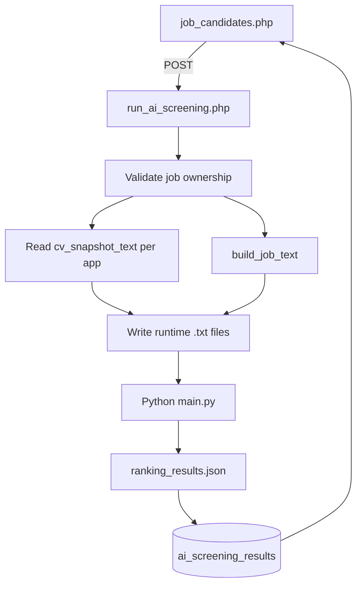

# Phase EMP-B — AI gợi ý xếp hạng ứng viên

> **Xác nhận:** User **`「xác nhận EMP-B」`** — 2026-06-06  
> **Phụ thuộc:** EMP-A merged (PR #14) · CV-C apply snapshot · `cv_snapshot_text` prep  
> **Nhánh:** `feature/phase-emp-b-cv-snapshot-text` (từ `main` @ PR #14)  
> **Tham chiếu:** `docs/web-cv-jd-input-contract.md`, `docs/php-web-ai-ranking-integration-guide.md`, `docs/cursor-prompt-topcv-lite-ai-ranking.md`

---

## 1. Mục tiêu phase

Trên **`employer/job_candidates.php?job_id=`**, employer bấm **「Chạy AI gợi ý xếp hạng」** → PHP gọi **Python CLI** (`SEMANTIC_SKILLS_RESUME`) → lưu kết quả → hiển thị **AI Rank / Score / Recommendation** + modal **review card**.

**Không làm HTTP API Python** trong phase này — chỉ CLI.

---

## 2. Quy trình phase

| # | Việc | Ai |
|---|------|-----|
| 1 | User đọc plan + checklist + 3 doc integration | Bạn |
| 2 | User **`「chốt cv_snapshot_text」`** | ✅ |
| 3 | User **`「xác nhận EMP-B」`** | ✅ 2026-06-06 |
| 4 | Nhánh `feature/phase-emp-b-cv-snapshot-text` | ✅ |
| 5 | User **`「bắt đầu B1」`** … **`「Bx pass」`** | Chờ |
| 6 | User **`「EMP-B pass」`** → PR → merge | Chờ |

**AI không được:** sửa code Python; làm FastAPI; làm VIP/quota; PDF/OCR fallback; sửa nặng `manage-jobs.php`; gộp nhiều khối B một lúc.

---

## 3. Thiết kế đã chốt

### 3.1 Nguồn CV

| Quyết định | Chi tiết |
|------------|----------|
| Apply chỉ CV online | Không upload PDF apply |
| PDF cũ | Bỏ qua — không fallback extract |
| Text cho AI | **`applications.cv_snapshot_text`** (lưu lúc apply) |
| Hiển thị CV | **`applications.cv_snapshot_json`** (modal — đã có) |

Prep đã merge trên nhánh: `includes/cv_snapshot_text.php`, migration `cv_snapshot_text`.

### 3.2 Nguồn JD

Từ bảng `jobs` (theo `job_id`), build plain text:

```text
{title}

Requirements:
- {requirements — split dòng}
- {experience}
- {job_level} (tuỳ)

Nice to have:
- {benefits hoặc dòng tách từ description nếu cần}

Responsibilities:
- {description — split dòng}
```

DB hiện **không** có cột `nice_to_have` / `responsibilities` riêng — build từ `requirements`, `description`, `experience`, `benefits`.

### 3.3 Tích hợp Python

```text
C:\SEMANTIC_SKILLS_RESUME\.venv\Scripts\python.exe
C:\SEMANTIC_SKILLS_RESUME\main.py
  --jd {runtime}/jd.txt
  --cv-dir {runtime}/cvs/
  --output-json {runtime}/ranking_results.json
```

Runtime (ngoài webroot):

```text
C:\topcv_ai_runtime\job-{job_id}\run-{timestamp}\
  jd.txt
  cvs\application-{app_id}__candidate-{candidate_id}.txt
  ranking_results.json
```

Map kết quả: parse `source_file` → `application_id`.

### 3.4 Lưu kết quả DB

Bảng riêng **`ai_screening_results`** (không sửa `applications`):

| Cột | Mô tả |
|-----|--------|
| job_id, application_id, candidate_id | FK logic |
| ai_rank, final_score, recommendation | Hiển thị bảng |
| scores_json, review_card_json, raw_result_json | Chi tiết |
| run_id, created_at, updated_at | Audit |

UNIQUE `(job_id, application_id)` — mỗi lần chạy ghi đè.

---

## 4. Luồng runtime



---

## 5. UI `job_candidates.php`

Thay placeholder AI bằng:

- Panel + nút **「Chạy AI gợi ý xếp hạng」** (CSRF)
- Cột **AI Rank**, **AI Score**, **Recommendation**
- Sort theo `ai_rank` khi có kết quả
- Nút **「Xem AI review」** → modal (summary, strengths, concerns, evidence, câu hỏi PV)
- Thời gian screened gần nhất

---

## 6. File mới / sửa (dự kiến)

| File | Khối |
|------|------|
| `config/ai_screening.example.php` | B1 |
| `includes/ai_screening_job_text.php` | B1 |
| `includes/schema_ai_screening.php` | B1 |
| `includes/repositories/AiScreeningRepository.php` | B2 |
| `includes/services/AiScreeningService.php` | B2 |
| `docs/migrations/phase-emp-b-ai-screening.sql` | B1 |
| `employer/run_ai_screening.php` | B3 |
| `employer/job_candidates.php` | B3–B4 |

**Không sửa:** `manage-jobs.php`, Python project, `applicants.php` (ngoài regression test).

---

## 7. Bảo mật

- `auth_check.php` + `getJobOwnedByCompany()`
- CSRF trên action chạy AI
- Path runtime do backend tạo — quote path khi `exec`
- Runtime folder không public
- Employer B không chạy AI job của A

---

## 8. Khối triển khai (B0→B5)

| Khối | Nội dung | Pass khi |
|------|----------|----------|
| **Prep** | `cv_snapshot_text` lúc apply + migration | ✅ committed |
| **B0** | Plan + checklist + confirm | **`「xác nhận EMP-B」`** ✅ |
| **B1** | Config AI paths + `build_job_text` + bảng `ai_screening_results` | JD text + schema OK |
| **B2** | `AiScreeningService` — runtime files + CLI + parse + save | Script PHP chạy AI → DB có row |
| **B3** | `run_ai_screening.php` + UI cột rank trên `job_candidates.php` | Bấm nút → thấy rank/score |
| **B4** | Modal review + error handling + regression | Lỗi Python hiện message; modal OK |
| **B5** | Test manual checklist §10 | **`「EMP-B pass」`** → PR |

---

## 9. Test manual (checklist rút gọn)

- [ ] Migration `cv_snapshot_text` đã chạy; apply mới có text
- [ ] Employer A: job ≥2 UV có `cv_snapshot_text` → chạy AI OK
- [ ] Bảng hiển thị rank / score / recommendation
- [ ] Modal review card đầy đủ
- [ ] Employer B không chạy AI job A
- [ ] JD thiếu nội dung → message rõ, không crash
- [ ] UV thiếu text → skip + thông báo
- [ ] Python path sai → message thân thiện + log
- [ ] Đổi status UV / CV modal vẫn OK (regression EMP-A)

---

## 10. Defer (sau EMP-B)

| Hạng mục | Phase |
|----------|-------|
| FastAPI / POST JSON | EMP-B+ hoặc riêng |
| AI trên hub `candidate_screening.php` | Sau |
| VIP / quota screening | EMP-C |
| Queue / background job | Sau |
| Cột JD `nice_to_have` riêng trên form job | Tuỳ chọn |

---

## 11. Commit gợi ý

```text
docs(emp-b): plan va checklist AI ranking (B0)
feat(emp-b): config va build JD text + schema ai_screening_results (B1)
feat(emp-b): goi Python CLI va luu ket qua (B2)
feat(emp-b): UI xep hang tren job_candidates (B3)
feat(emp-b): review modal va error handling (B4)
```
