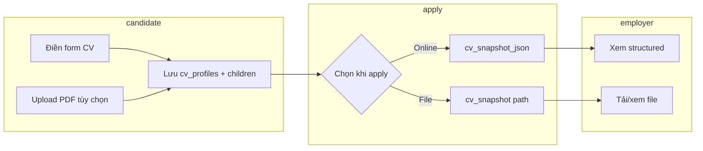

# Roadmap — CV có cấu trúc (Structured CV Builder)

> **Trạng thái:** User **`「xác nhận CV roadmap」`** (2026-05-29). Chi tiết UX: `docs/phase-cv-0-ux-spec.md` — chờ **`「xác nhận CV-0」`**.

> **Mục tiêu sản phẩm:** Ứng viên điền form chuẩn (giống TopCV) để NTD/admin **đọc và đánh giá trực quan**; vẫn hỗ trợ upload PDF/DOC.  
> **Tiền đề kỹ thuật:** Phase 1 upload ✅ | Phase 2A/2B ✅ | Nên **hoàn tất 2C + 2D** trước khi code CV (tránh nhiều nhánh migration song song).  
> **Kiến trúc:** Page Controller + `CvService` / `CvRepository` (theo `architecture-standardization-plan.md`).

---

## 1. Hiện trạng vs mục tiêu

| Hiện tại | Mục tiêu |
|----------|----------|
| `candidates.cv_path` — 1 file PDF/DOC | 1 **hồ sơ CV có cấu trúc** (nhiều section, nhiều dòng) |
| `applications.cv_snapshot` — copy file khi apply | Snapshot = **bản CV structured tại thời điểm ứng tuyển** (+ file PDF tùy chọn) |
| NTD xem file, khó so sánh | NTD xem **form/table** thống nhất trên trình duyệt |

**Nguyên tắc:** Upload file **không bị bỏ** — dùng làm đính kèm / nguồn điền form (giai đoạn sau), không thay thế dữ liệu structured khi đánh giá.

---

## 2. Phạm vi tính năng (theo mức độ)

### MVP (đủ cho đồ án + demo)
- Form điền: thông tin cá nhân, mục tiêu, học vấn, kinh nghiệm, kỹ năng (các section cốt lõi).
- Thêm/xóa/sắp xếp từng dòng trong section (JS đơn giản hoặc POST “thêm 1 dòng”).
- **Nhiều CV / 1 user:** mỗi bản = 1 dòng `cv_profiles` (tên VD: `cv1`, `cv2`), data section lưu theo `cv_id` — **không** ghi đè khi đổi tên trên form.
- **`is_primary`:** chỉ đánh dấu CV mặc định khi ứng tuyển (1 cờ / candidate), **không** giới hạn chỉ được tạo 1 CV.
- Trang **Quản lý CV** + lưu/load theo `cv_id` (xem mục 3.5).
- Xem trước HTML (template đơn giản).
- Khi ứng tuyển: chọn **bản CV nào** (dropdown) hoặc upload file (giữ flow cũ).

### Giai đoạn 2 (sau MVP)
- Thêm section: hoạt động, chứng chỉ, giải thưởng, người giới thiệu, sở thích (như ảnh TopCV).
- Đổi mẫu CV (2–3 template CSS).
- Export PDF (Dompdf / mPDF).

### Giai đoạn 3 (khớp master roadmap Phase 4)
- Upload PDF/DOC → **gợi ý điền form** (parse rule-based hoặc API AI) — **không bắt buộc cho MVP**.
- Matching JD ↔ CV (rule trên field structured).

---

## 3. Thiết kế database (đề xuất)

### 3.1 Bảng chính — `cv_profiles`

Một ứng viên có thể có nhiều CV; một CV “đang dùng” khi apply.

| Cột | Kiểu | Ghi chú |
|-----|------|--------|
| `id` | PK | |
| `candidate_id` | FK → `candidates.id` | |
| `title` | varchar | VD: "CV IT Fresher 2026" |
| `full_name` | varchar | |
| `target_position` | varchar | Vị trí ứng tuyển |
| `date_of_birth` | date NULL | |
| `gender` | varchar NULL | |
| `phone` | varchar | |
| `email` | varchar | |
| `website` | varchar NULL | |
| `address` | text NULL | |
| `avatar_path` | varchar NULL | uploads/avatars/ |
| `career_objective` | text NULL | Mục tiêu nghề nghiệp |
| `interests` | text NULL | Sở thích (1 khối text) |
| `attachment_path` | varchar NULL | File PDF/DOC upload (legacy bridge) |
| `template_key` | varchar | default `classic` |
| `is_primary` | tinyint(1) | Chỉ 1 primary / candidate |
| `completion_percent` | tinyint | Tùy chọn — % hoàn thiện |
| `created_at`, `updated_at` | datetime | |

**Quan hệ `candidates`:**
- Thêm `primary_cv_id` (FK NULL) **hoặc** chỉ query `cv_profiles WHERE is_primary = 1`.
- Giữ `cv_path` tạm thời → deprecate sau khi migrate xong (ghi trong migration note).

### 3.2 Bảng con (one-to-many, có `sort_order`)

| Bảng | Field chính |
|------|-------------|
| `cv_educations` | `cv_id`, `start_date`, `end_date`, `school_name`, `major`, `description`, `sort_order` |
| `cv_experiences` | `cv_id`, `start_date`, `end_date`, `company_name`, `position`, `description`, `sort_order` |
| `cv_activities` | `cv_id`, `start_date`, `end_date`, `organization`, `role`, `description`, `sort_order` |
| `cv_certificates` | `cv_id`, `issued_at`, `certificate_name`, `sort_order` |
| `cv_awards` | `cv_id`, `awarded_at`, `title`, `description`, `sort_order` |
| `cv_skills` | `cv_id`, `skill_name`, `description`, `sort_order` |
| `cv_projects` | `cv_id`, `start_date`, `end_date`, `project_name`, `position`, `description`, `sort_order` |
| `cv_references` | `cv_id`, `full_name`, `position`, `contact_info`, `sort_order` |

**Index:** `(cv_id, sort_order)` trên mỗi bảng con.

### 3.3 Ứng tuyển — mở rộng `applications`

| Cột mới | Mục đích |
|---------|----------|
| `cv_profile_id` | FK → bản CV structured đã chọn |
| `cv_snapshot_json` | JSON copy toàn bộ CV tại lúc apply (immutable) |
| Giữ `cv_snapshot` | Đường dẫn file nếu user chọn upload |

> Snapshot JSON giúp NTD xem đúng bản lúc ứng tuyển dù ứng viên sửa CV sau.

### 3.4 Không dùng 1 bảng JSON lớn cho MVP?

- **JSON 1 cột:** nhanh code, khó query (“ứng viên biết Python”).
- **Bảng chuẩn hóa:** phù hợp đồ án, filter, matching sau này → **khuyến nghị cho dự án này**.

### 3.5 Luồng nhiều CV (theo yêu cầu sản phẩm)

| Bước user | Hệ thống |
|-----------|----------|
| Vào **Quản lý CV** | `SELECT * FROM cv_profiles WHERE candidate_id = ?` → danh sách cv1, cv2… |
| **Tạo CV mới**, nhập tên `cv1`, điền form, **Lưu** | `INSERT cv_profiles` + `INSERT` các dòng `cv_educations`… gắn `cv_id` mới |
| Tạo thêm **cv2** (nội dung khác cho công ty khác) | `INSERT` **bản ghi mới** — cv1 **giữ nguyên** trong DB |
| Bấm **Sửa** trên cv1 | Mở `cv-builder.php?id=<cv_id>` — load đúng data của cv1 |
| Bấm **Sửa** trên cv2 | Cùng trang editor, `id` khác — load data cv2 |
| Profile | Hiển thị danh sách CV (hoặc link “Quản lý CV”) — không nhầm với 1 file PDF duy nhất |

**Không làm:** một form duy nhất, đổi ô “Tên CV” từ cv1 → cv2 rồi Lưu (sẽ chỉ **đổi tên** bản hiện tại hoặc gây nhầm — phải dùng **Tạo mới** để có bản thứ hai).

**Lưu data khi nhập:** mỗi lần bấm **Lưu** → `CvService::saveProfile($cvId, …)` cập nhật `cv_profiles` + xóa-thay child rows (transaction) cho **đúng `cv_id`**.

### 3.6 Điều hướng (IA) — cần chốt ở CV-0

| Vai trò | Trang | Ghi chú |
|---------|-------|--------|
| Candidate | `candidate/cv-manage.php` | Hub: danh sách CV |
| Candidate | `candidate/cv-builder.php?id=` | Tạo/sửa |
| Candidate | `candidate/cv-preview.php?id=` | Xem trước |
| Candidate | `candidate/profile.php` | Bio + link CV; **giữ** upload PDF legacy tạm thời |
| Guest/apply | `job-detail.php` | Chọn CV + apply |
| Employer | `employer/applicants.php` | **File thật hiện có** — thêm modal/tab xem structured |
| Menu | `includes/header.php` | Link “Quản lý CV online” cho role candidate |

---

## 4. Chia phase (tuân thủ quy trình dự án)

Quy trình **mỗi nhóm** (bắt buộc):

1. AI gửi **mini-plan nhóm** (`docs/phase-cvX-plan.md`)
2. User: **`「xác nhận CV-X」`**
3. Code + migration + test checklist
4. User test → **`「CV-X pass」`**
5. Cập nhật `dev-learning-log.md`, `project-memory/*`
6. User tự git: `phase CV: <mô tả> (nhóm CV-X)` → PR

### Vị trí trên timeline tổng (phiên bản đã chỉnh — **khuyến nghị**)

```text
Phase 2C → 2D (xong trước)
        ↓
CV-0  Thiết kế UX/IA + wireframe (CHỈ DOCS)
        ↓
CV-A  DB + Service layer (backend)
        ↓
CV-B  UI ứng viên: quản lý + builder + profile
        ↓
CV-C  Tích hợp: preview + apply + employer xem
        ↓
CV-D  Section đầy đủ + template + polish UX
        ↓
CV-E  Import PDF → AI điền sẵn form (Mức B, tùy chọn)
        ↓
CV-F  GPT Vision scan PDF + smart router (Mức C) — ✅ xác nhận, chờ code
```

### Ma trận phụ thuộc

| Phase | Phụ thuộc | Deliverable chính |
|-------|-----------|-------------------|
| CV-0 | 2D pass (khuyến nghị) | `docs/phase-cv-0-ux-spec.md` |
| CV-A | CV-0 | Migration, `CvService`, `cv_rules` |
| CV-B | CV-A | `cv-manage`, `cv-builder`, menu, profile |
| CV-C | CV-B | `apply`, `applicants`, `cv-preview`, snapshot |
| CV-D | CV-C | Bảng section còn lại, template, JS reorder |
| CV-E | CV-D | Import PDF, AI parse → pre-fill builder, `attachment_path` |
| CV-F | CV-E pass | GPT vision PDF, router, Structured Outputs |

### Scope đồ án tối thiểu (MVP triển khai)

**Bắt buộc:** CV-0 → CV-A → CV-B → CV-C  
**Nên có:** CV-D (đủ section như mock TopCV)  
**Tùy chọn:** CV-E, CV-F

---

## Nhóm CV-0 — Thiết kế UX / IA (P0, **chỉ tài liệu**)

> **Trước đây roadmap thiếu phase này** — CV-C ghi “UX editor” nhưng đặt sau integrate → dễ code nhầm UI sớm.

### Phạm vi
- Wireframe (giấy/Figma/ảnh chú thích): `cv-manage`, `cv-builder`, `cv-preview`, apply chọn CV, employer xem hồ sơ
- Danh sách field **bắt buộc / tùy chọn** từng section (map → cột DB mục 3)
- Luồng: Tạo mới vs Sửa vs Đặt primary vs Xóa (confirm)
- Quyết định MVP UI: Bootstrap form + nút “+ Thêm dòng” (chưa sidebar TopCV, chưa WYSIWYG từng ô)
- File: `docs/phase-cv-0-ux-spec.md`

### Không làm
- Code PHP, migration

### Test / hoàn thành
- [ ] User đọc và **`「xác nhận CV-0」`**
- [ ] ERD + sơ đồ màn hình đủ để code CV-A không đoán UI

### Commit gợi ý
`docs: phase CV-0 wireframe và IA CV structured`

---

## Nhóm CV-A — Database + Service layer (P0)

### Phạm vi
- Migration: `cv_profiles` + `cv_educations`, `cv_experiences`, `cv_skills` (+ index FK)
- `schema_cvs.php` — `cvs_schema_ready()`
- `CvRepository`, `CvService`, `cv_rules.php` — CRUD, save children (transaction), `buildSnapshotJson()`
- `docs/migrations/migrate-phase-cv-a.php`
- **Không** làm giao diện đẹp — tối đa 1 trang test nội bộ (optional) hoặc test qua CLI

### Không làm trong CV-A
- `cv-manage` / `cv-builder` hoàn chỉnh (chuyển CV-B)
- `applications` alter, apply, employer (chuyển CV-C)
- Parse PDF, export PDF

### Test checklist
- [ ] Migration chạy OK
- [ ] Service: tạo 2 CV + lưu section — data tách `cv_id`
- [ ] `is_primary` chỉ 1 / candidate
- [ ] User A không đọc/sửa CV user B

### Commit gợi ý
`phase CV: schema và service CV structured (nhóm CV-A)`

---

## Nhóm CV-B — UI ứng viên (quản lý + builder) (P0)

### Phạm vi
- `candidate/cv-manage.php` — list, Tạo mới, Sửa, Xóa (POST+CSRF), Đặt mặc định
- `candidate/cv-builder.php` — form section lõi (personal, objective, education, experience, skill); JS thêm/xóa dòng
- `candidate/profile.php` — list CV + link; giữ upload PDF cũ (bridge)
- `includes/header.php` — menu candidate
- CSRF: `candidate_cv_save_form`, `candidate_cv_delete_form`, `candidate_cv_primary_form`
- `assets/js/cv-builder.js` (nếu tách JS)

### Không làm trong CV-B
- Apply / snapshot / employer
- Template đổi mẫu, section activities/certificates (CV-D)

### Test checklist
- [ ] Tạo **cv1** + **cv2** — data độc lập
- [ ] Sửa cv1 → cv2 không đổi
- [ ] Quản lý CV: click → đúng nội dung
- [ ] Lưu không duplicate dòng con
- [ ] Mobile: form dùng được (Bootstrap responsive)
- [ ] Empty state: chưa có CV → CTA “Tạo CV đầu tiên”

### Commit gợi ý
`phase CV: UI quản lý và tạo CV ứng viên (nhóm CV-B)`

---

## Nhóm CV-C — Preview + tích hợp ứng tuyển + NTD (P0)

### Phạm vi
- Migration: `applications.cv_profile_id`, `applications.cv_snapshot_json` (nullable)
- `candidate/cv-preview.php?id=` — HTML template `classic` (1 mẫu)
- `job-detail.php` / `apply.php`:
  - Dropdown chọn CV (`cv_profiles` của user)
  - `CvService::snapshotForApply()` → lưu JSON + id
  - Giữ nhánh upload file → `cv_snapshot`
- `employer/applicants.php` — modal hoặc trang con xem structured từ `cv_snapshot_json` + link file cũ

### Test checklist
- [ ] Apply CV online → employer thấy structured
- [ ] Sửa CV sau apply → employer vẫn thấy snapshot cũ
- [ ] Apply upload file → regression OK
- [ ] Chưa có CV online → UI hướng tạo CV hoặc upload
- [ ] CSRF apply

### Commit gợi ý
`phase CV: preview, apply snapshot và employer xem CV (nhóm CV-C)`

---

## Nhóm CV-D — Section đầy đủ + template + polish UX (P1)

### Phạm vi
- Migration bảng: `cv_activities`, `cv_certificates`, `cv_awards`, `cv_references`
- Mở rộng `cv-builder` + preview cho đủ section (ảnh TopCV)
- Template `classic` + `modern`; chọn `template_key` khi lưu
- Avatar upload (`upload_validate` image)
- UX: confirm xóa CV; badge % hoàn thiện (optional); sắp xếp `sort_order` (JS)

### Không làm
- AI parse

### Test checklist
- [ ] Mọi section lưu/load đúng
- [ ] Đổi template → preview đổi giao diện
- [ ] Avatar hiển thị preview

### Commit gợi ý
`phase CV: đầy đủ section và template CV (nhóm CV-D)`

---

## Nhóm CV-E — Import PDF → AI điền sẵn form (P2, Mức B)

> Chi tiết: **`docs/phase-cv-e-plan.md`**, setup: **`docs/setup-cv-import.md`**

### Phạm vi
- Upload **PDF** trên `cv-import.php` → trích text local → **AI** map JSON → pre-fill `cv-builder`
- User review/sửa → Lưu → `cv_profiles` + `attachment_path` (file gốc)
- Fallback rule-based khi API lỗi; rate limit import
- (Backlog) Export PDF preview, nhân bản CV, migrate `cv_path`

### Không làm
- OCR PDF scan, DOC/DOCX → **CV-F**
- Auto-lưu không qua builder; parse tại apply

### Test checklist
- [ ] PDF text → form có dữ liệu hợp lý
- [ ] Lưu → preview + apply snapshot OK
- [ ] PDF scan / API lỗi → thông báo rõ

### Commit gợi ý
`phase CV: import PDF và AI điền sẵn form CV (nhóm CV-E, Mức B)`

---

## Nhóm CV-F — GPT Vision scan PDF (P3, Mức C)

> **Xác nhận:** User **`「xác nhận CV-F」`** — 2026-06-05  
> Chi tiết: **`docs/phase-cv-f-plan.md`**, checklist: **`docs/project-memory/phase-cv-f-checklist.md`**  
> Nhánh: **`feature/phase-cv-f-vision`**

### Phạm vi (MVP)
- Smart router: text tốt → CV-E (Groq); scan / Canva noisy → **OpenAI GPT-4o PDF vision**
- Structured Outputs (`json_schema` strict); tái dùng normalize + builder + `attachment_path`
- UI toggle: Tự động / Nhanh (text) / Chuẩn (GPT)
- Rate limit GPT riêng (~3/h/user)

### Không làm (defer)
- Tesseract OCR local; queue async; confidence score từng field
- DOCX import (F7 optional sau pass)

### Test checklist
- [ ] PDF scan → form có dữ liệu
- [ ] Canva 2 cột → ít mục “chỉ có ngày”
- [ ] Text PDF → auto path Groq (regression CV-E)
- [ ] Lưu → preview + apply snapshot OK

### Commit gợi ý
`phase CV: GPT vision scan PDF import (nhóm CV-F, Mức C)`

---

## 10. Đánh giá roadmap (audit 2026-05-29)

### Điểm đã ổn

| Hạng mục | Đánh giá |
|----------|----------|
| Tách DB chuẩn hóa vs JSON | ✅ Phù hợp đồ án + đánh giá NTD |
| Nhiều CV / `cv_id` | ✅ Mục 3.5 rõ |
| Snapshot khi apply | ✅ Đúng nghiệp vụ |
| Quy trình confirm/pass/git | ✅ Khớp Phase 1–2 |
| Giảm scope (không clone TopCV 100%) | ✅ Mục 7 |

### Điểm **chưa chuẩn** (đã chỉnh trong file này)

| Vấn đề | Mức độ | Cách xử lý |
|--------|--------|------------|
| **Không có phase UI/UX riêng** trước khi code | 🔴 Cao | Thêm **CV-0** |
| CV-A cũ gộp backend + UI builder | 🔴 Cao | Tách **CV-A** backend, **CV-B** UI |
| CV-C cũ ghi “UX editor” nhưng sau integrate | 🟡 Trung bình | UX nặng → **CV-D**; CV-B form cơ bản |
| Thiếu phase employer/file thật | 🟡 | Sửa → `employer/applicants.php` |
| Mục 3.5 đứng trước 3.2 | 🟢 Nhỏ | Đã sắp lại 3.1→3.6 |
| Thiếu: duplicate CV, soft-delete CV, migrate `cv_path` | 🟡 | Ghi backlog CV-D/E |
| Section 2 “Giai đoạn 2/3” vs CV-A…D dễ trùng | 🟡 | MVP = CV-0..C; section 2 = vision dài hạn |

### Checklist **sẵn sàng implement**

- [ ] Phase **2C + 2D** pass
- [ ] **`「xác nhận CV roadmap」`** (bản đã chỉnh phase)
- [ ] **`「xác nhận CV-0」`** sau khi có wireframe
- [ ] Chốt MVP: **CV-0 → A → B → C** (đủ demo end-to-end)
- [ ] Vẽ ERD (draw.io) từ mục 3

### Điểm readiness tổng thể

| Tiêu chí | Trước audit | Sau chỉnh roadmap |
|----------|-------------|-------------------|
| Logic từng bước | 6/10 | **9/10** |
| Phase UI/UX | 3/10 (lẫn trong C) | **8/10** (CV-0 + CV-B + CV-D) |
| Khớp codebase hiện tại | 7/10 | **9/10** |
| Sẵn sàng code ngay | ❌ | ✅ sau CV-0 + 2D |

---

## 5. Layer code (gợi ý file)

```text
includes/repositories/CvRepository.php      # SQL CRUD
includes/services/CvService.php             # transaction, primary, snapshot
includes/cv_rules.php                       # validate dates, required fields
candidate/cv-manage.php                     # list nhiều CV
candidate/cv-builder.php                    # form edit theo cv_id
candidate/cv-preview.php                    # HTML preview
employer/applicants.php                     # modal xem cv_snapshot_json
assets/js/cv-builder.js
docs/migrations/phase-cv-a-structured.sql
docs/migrations/phase-cv-c-applications.sql
docs/migrations/migrate-phase-cv-a.php
docs/phase-cv-0-ux-spec.md
docs/phase-cv-a-plan.md
```

---

## 6. Luồng nghiệp vụ (tóm tắt)



---

## 7. Rủi ro & cách giảm scope

| Rủi ro | Cách xử lý |
|--------|------------|
| Scope quá lớn (clone TopCV) | Chỉ CV-A + CV-B cho demo đồ án; C/D defer |
| Parse PDF khó | CV-D mức nhẹ; AI để Phase 4 |
| Migration phức tạp | Migrate dữ liệu cũ: `cv_path` → `attachment_path`, `is_primary=1` bản ghi trống |
| Form UX nặng | Bootstrap + repeat rows; chưa CKEditor từng field |

---

## 8. Việc bạn nên làm **ngay bây giờ**

1. **Hoàn tất Phase 2:** `2C` → `2D` pass.
2. **`「xác nhận CV roadmap」`** — chốt bản phase CV-0…F ở trên.
3. Làm **CV-0:** wireframe + `phase-cv-0-ux-spec.md` → **`「xác nhận CV-0」`**.
4. **`「xác nhận CV-A」`** → code backend (không UI đẹp).
5. Lần lượt B → C (MVP end-to-end); D nếu cần đủ section TopCV.

**MVP đồ án:** CV-0 + CV-A + CV-B + CV-C (= có thể tạo nhiều CV, lưu, apply, NTD xem).

---

## 9. Tham chiếu

- `candidate/profile.php` — upload hiện tại
- `apply.php`, `applications.cv_snapshot`
- `docs/master-refactor-roadmap.md` — Phase 4 CV/JD parsing
- `docs/architecture-standardization-plan.md`
- `docs/coding-conventions.md`
